# 🚀 Título del Proyecto: Music Stream
<!-- Maqueta de plataforma de streaming musical con tienda integrada -->
> Una maqueta interactiva desarrollada para simular una experiencia completa de compra y reproducción de música digital.

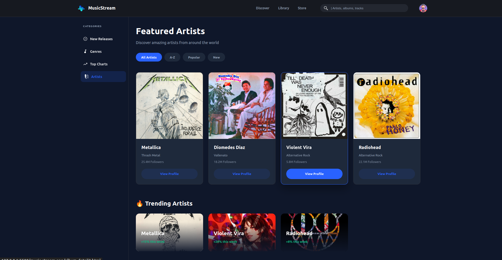
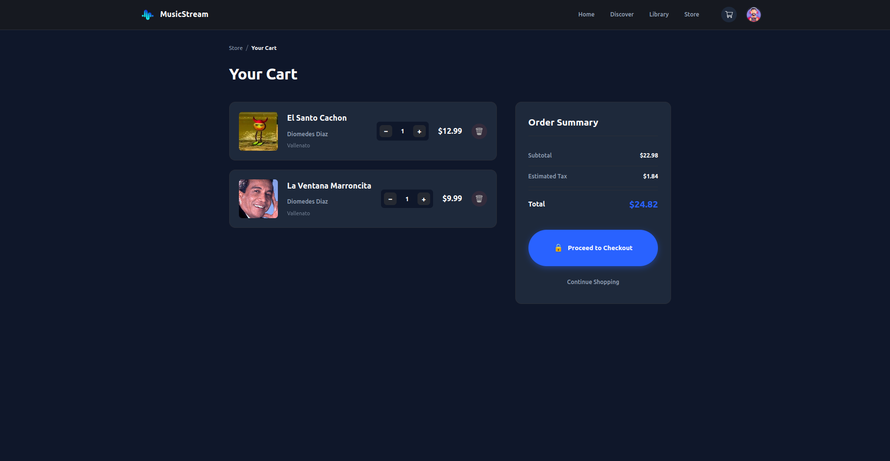
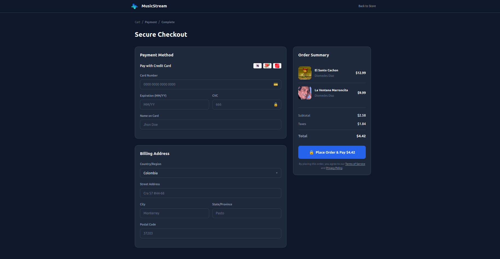
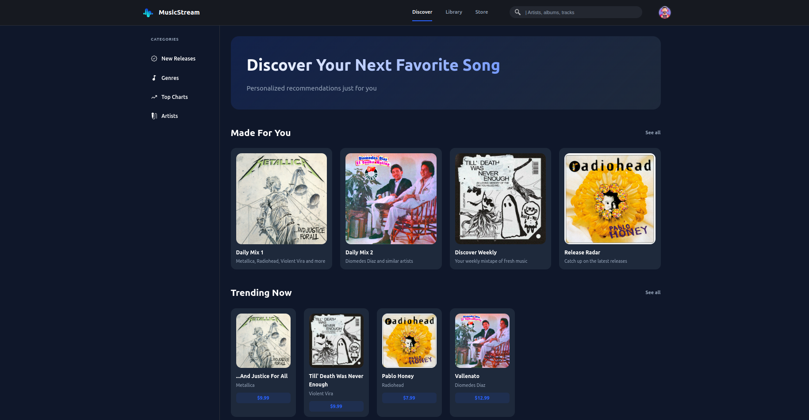
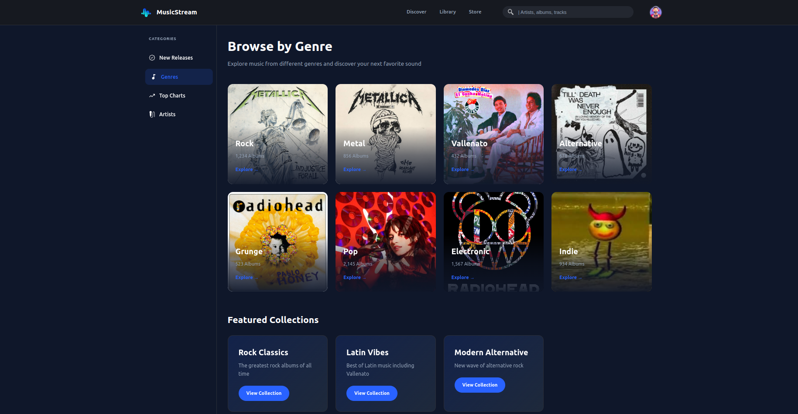
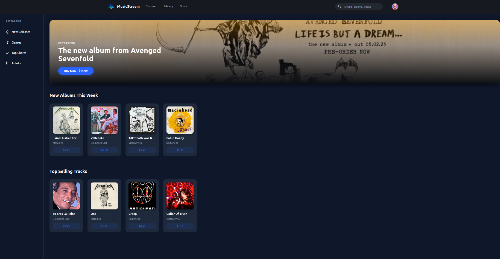
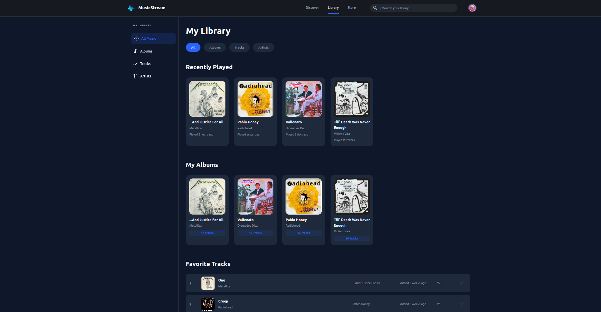
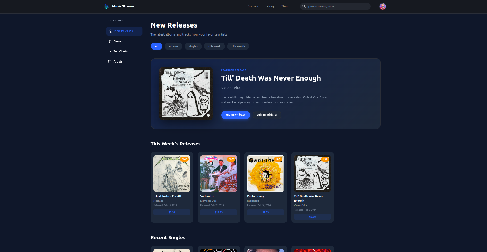
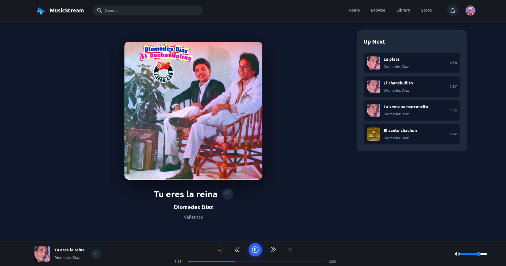
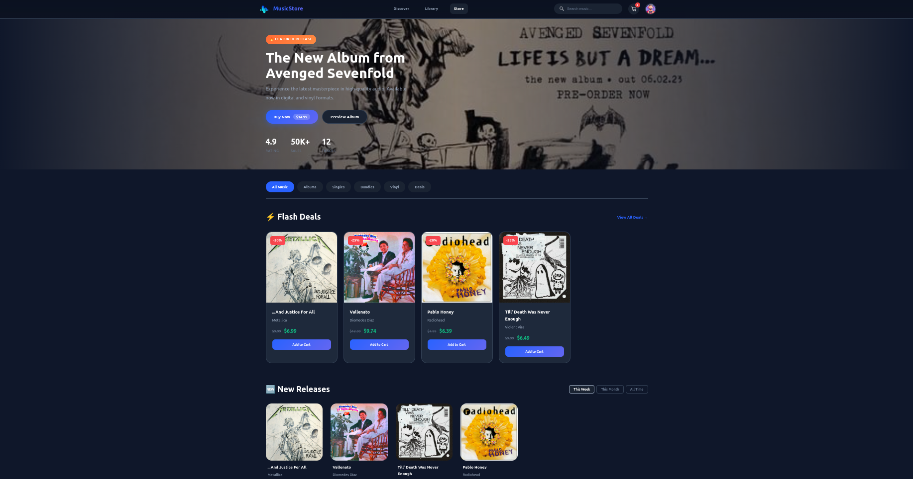
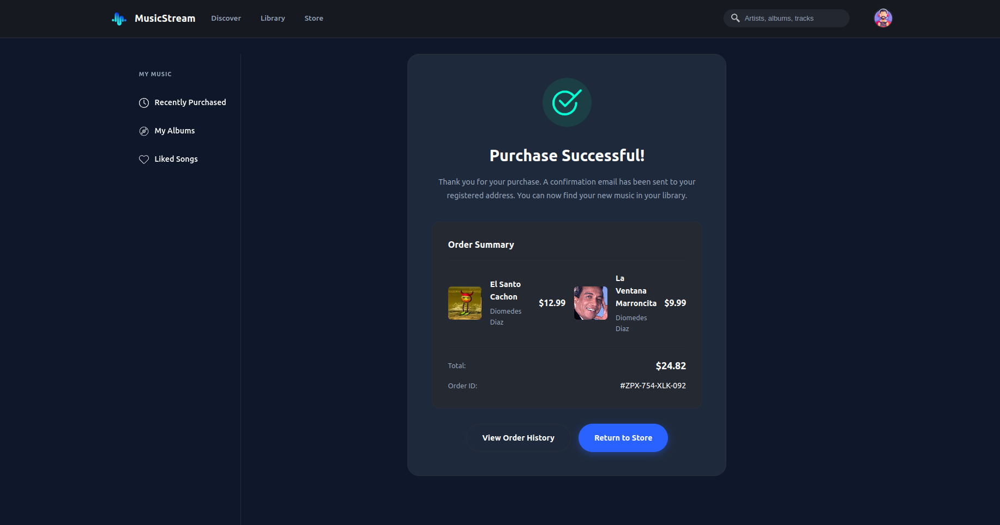
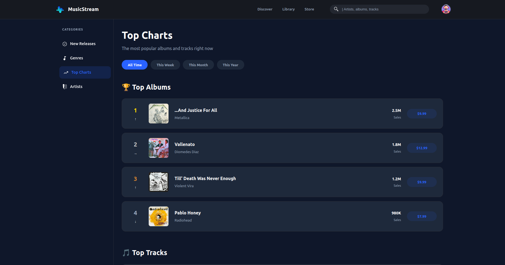

## Estructura del proyecto

music-stream-app/
├── index.html ✅
├── discover.html ✅
├── library.html ✅
├── store.html ✅
├── cart.html ✅
├── checkout.html ✅
├── success.html ✅
├── genres.html ✅
├── new-releases.html ✅
├── top-charts.html ✅
├── album-detail1.html ✅
├── album-detail2.html ✅
├── album-detail3.html ✅ 
├── album-detail4.html ✅ 
├── player1.html ✅
├── player2.html ✅ 
├── player3.html ✅
├── player4.html ✅
├── CSS/
│   ├── main.css ✅
│   ├── views/
│   │   ├── album.css ✅
│   │   ├── artists.css ✅
│   │   ├── cart.css ✅
│   │   ├── checkout.css ✅
│   │   ├── discover.css ✅
│   │   ├── genres.css ✅
│   │   ├── library.css ✅
│   │   ├── new-releases.css ✅
│   │   ├── player.css ✅
│   │   ├── store.css ✅
│   │   ├── success.css ✅
│   │   ├── top-charts.css ✅
└── assets/
    ├── img/ ✅
    ├── icons/ ✅
    └── capturas/ ✅

## 🔗 Enlace al Proyecto (Live Demo)
[Haz clic aquí para ver el repositorio](https://github.com/SebbsAL/Proyecto-HTML--CSS.git)

---

## 📝 Descripción
Music Stream es una maqueta frontend de una plataforma de streaming musical con tienda integrada que permite navegar por artistas, álbumes, géneros y realizar compras simuladas.

- **¿Qué problema resuelve?** Proporciona una interfaz visual funcional para demostrar flujos de usuario en e-commerce musical sin necesidad de backend.
- **¿A quién va dirigido?** Desarrolladores frontend que buscan referencias de estructura HTML/CSS, estudiantes que aprenden maquetación responsive y diseñadores UI que necesitan prototipos navegables.
- **¿Qué secciones incluye?** Header con navegación y búsqueda, Hero banner promocional, Sidebar de categorías, Grids de álbumes y tracks, Player de reproducción fijo, Carrito de compras, Checkout, Páginas de detalle de artista/álbum, y Footer informativo.

## 🛠️ Tecnologías Utilizadas
*   **HTML5** (estructura semántica, formularios, navegación)
*   **CSS3** (variables custom properties, Flexbox, CSS Grid, animaciones @keyframes, media queries responsive)

## 💻 Características
- 📱 **Diseño Responsive:** Adaptable a dispositivos móviles (320px+), tablets (768px+) y escritorio (1024px+) mediante media queries escalonadas.
- 🎨 **Estilo Moderno:** UI oscura con acentos en azul, tarjetas con hover effects, transiciones suaves y jerarquía visual clara.
- ⚡ **Ligero y Rápido:** Sin dependencias externas de JavaScript, carga optimizada con CSS puro para interacciones básicas.
- 🔄 **Navegación Multi-página:** 15+ páginas HTML interconectadas simulando una SPA.
- 🛒 **Flujo de Compra Completo:** Desde selección de álbum hasta confirmación de pedido (checkout → success).

## 🚀 Instalación y Uso
1.  Clona el repositorio: `git clone https://github.com/SebbsAL/Proyecto-HTML--CSS.git`
2.  Navega a la carpeta del proyecto: `cd Proyecto-HTML--CSS`
3.  Abre el archivo `index.html` en tu navegador preferido.
4.  Navega entre páginas usando los enlaces del header, sidebar o tarjetas de contenido.

> **Nota:** Al ser una maqueta estática, las funcionalidades de carrito, reproducción y búsqueda son visuales. No se requiere instalación de dependencias ni compilación.

## 🧠 Aprendizajes y Desafíos
*   **Aprendimos** a implementar sistemas de diseño escalables con CSS Custom Properties para mantener consistencia de colores, espaciados y tipografías en múltiples páginas.
*   **Aprendimos** a dominar CSS Grid y Flexbox para crear layouts complejos que se reorganizan fluidamente entre breakpoints responsive.
*   **Aprendimos** a estructurar proyectos HTML multi-página manteniendo coherencia en componentes reutilizables (header, sidebar, cards).
*   **Desafío principal:** Lograr que el sidebar colapsable y el player fijo inferior funcionen correctamente en todos los tamaños de pantalla sin romper la jerarquía visual.
*   **Desafío principal:** Implementar tabs de información (About/Reviews/Credits) usando únicamente CSS puro con inputs radio ocultos, sin JavaScript.
*   **Desafío principal:** Coordinar la sincronización visual entre múltiples páginas de detalle manteniendo rutas de assets relativas consistentes.

## 👥 Autores
*   **Sergio Aparicio** - *Desarrollador Frontend* - [Perfil de GitHub](https://github.com/SebbsAL/Proyecto-HTML--CSS.git)
*   **Sebastian Ayala** - *Desarrollador Frontend* - [Perfil de GitHub](https://github.com/SebbsAL/Proyecto-HTML--CSS.git)
*   **Brayan Fonseca** - *Desarrollador Frontend* - [Perfil de GitHub](https://github.com/SebbsAL/Proyecto-HTML--CSS.git)

## 📄 Licencia
Este proyecto está bajo la licencia [MIT](LICENSE).

**Implementaciones de maquetado propuestas a futuro:** 

creacion playlist

```
<!DOCTYPE html>
<html lang="es">
<head>
    <meta charset="UTF-8">
    <meta name="viewport" content="width=device-width, initial-scale=1.0">
    <title>Crear Playlist | MusicStream</title>
    <link rel="stylesheet" href="CSS/views/playlist-create.css">
    <link rel="icon" href="./assets/icons/favico.ico" type="image/png">
</head>
<body>
    <!-- Header -->
    <header class="header">
        <div class="header__container">
            <div class="header__logo">
                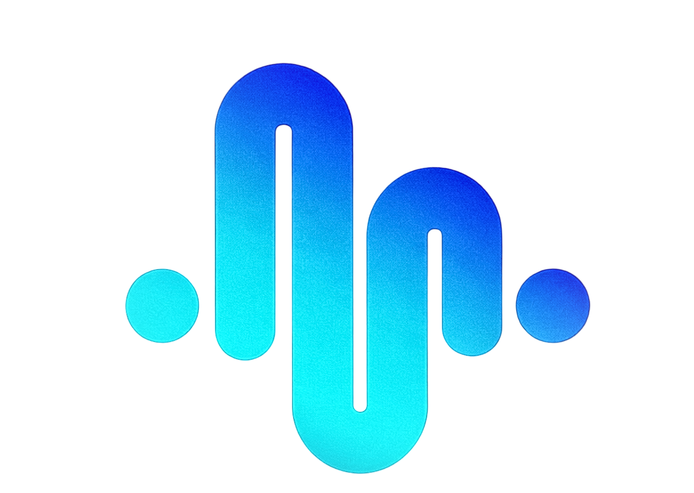
                <span class="header__logo-text">MusicStream</span>
            </div>
            <nav class="header__nav">
                <ul class="nav__list">
                    <li class="nav__item">
                        <a href="discover.html" class="nav__link">Discover</a>
                    </li>
                    <li class="nav__item">
                        <a href="library.html" class="nav__link">Library</a>
                    </li>
                    <li class="nav__item">
                        <a href="index.html" class="nav__link">Store</a>
                    </li>
                </ul>
            </nav>
            <div class="header__search">
                <button class="search__button">
                    
                </button>
                <input type="search" class="search__input" placeholder=" | Artists, albums, tracks">
            </div>
            <div class="header__user">
                <div class="user__avatar">
                    
                </div>
            </div>
        </div>
    </header>

    <div class="main-wrapper">
        <!-- Sidebar -->
        <aside class="sidebar">
            <h2 class="sidebar__title">MI BIBLIOTECA</h2>
            <nav class="sidebar__nav">
                <ul class="sidebar__menu">
                    <li class="sidebar__menu-item">
                        <a href="library.html" class="sidebar__link">
                            
                            <span class="link__text">Mi Biblioteca</span>
                        </a>
                    </li>
                    <li class="sidebar__menu-item">
                        <a href="playlist-create.html" class="sidebar__link sidebar__link--active">
                            
                            <span class="link__text">Crear Playlist</span>
                        </a>
                    </li>
                    <li class="sidebar__menu-item">
                        <a href="profile.html" class="sidebar__link">
                            
                            <span class="link__text">Mi Perfil</span>
                        </a>
                    </li>
                </ul>
            </nav>
        </aside>

        <!-- Main Content -->
        <main class="content">
            <div class="playlist-header">
                <h1 class="page-title">Crear Nueva Playlist</h1>
                <p class="page-subtitle">Organiza tu música favorita en playlists personalizadas</p>
            </div>

            <!-- Playlist Form -->
            <section class="playlist-form-section">
                <div class="playlist-form">
                    <div class="playlist-cover-upload">
                        <div class="cover-preview">
                            
                            <button class="cover-preview__change">📷</button>
                        </div>
                        <p class="cover-preview__text">Haz clic para cambiar la portada</p>
                    </div>

                    <div class="form-group">
                        <label for="playlist-name" class="form-label">Nombre de la Playlist</label>
                        <input type="text" id="playlist-name" class="form-input" placeholder="Ej: Mis Canciones Favoritas" required>
                    </div>

                    <div class="form-group">
                        <label for="playlist-description" class="form-label">Descripción (Opcional)</label>
                        <textarea id="playlist-description" class="form-textarea" placeholder="Describe tu playlist..." rows="3"></textarea>
                    </div>

                    <div class="form-group">
                        <label for="playlist-privacy" class="form-label">Privacidad</label>
                        <select id="playlist-privacy" class="form-select">
                            <option value="public">Pública - Cualquiera puede ver</option>
                            <option value="private">Privada - Solo tú puedes ver</option>
                            <option value="friends">Amigos - Solo amigos pueden ver</option>
                        </select>
                    </div>

                    <div class="form-actions">
                        <button type="button" class="btn btn--secondary">Cancelar</button>
                        <a href="library.html" class="btn btn--primary">Crear Playlist</a>
                    </div>
                </div>
            </section>

            <!-- Add Songs Section -->
            <section class="add-songs-section">
                <h2 class="section__title">Agregar Canciones</h2>
                
                <div class="search-songs">
                    <div class="search-songs__input">
                        
                        <input type="search" class="search-songs__field" placeholder="Buscar canciones para agregar...">
                    </div>
                </div>

                <div class="songs-list">
                    <div class="song-item">
                        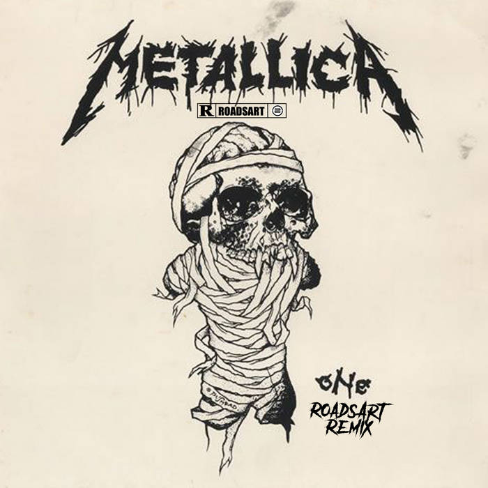
                        <div class="song-item__info">
                            <h4 class="song-item__title">One</h4>
                            <p class="song-item__artist">Metallica</p>
                        </div>
                        <span class="song-item__duration">7:26</span>
                        <button class="song-item__add">+</button>
                    </div>

                    <div class="song-item">
                        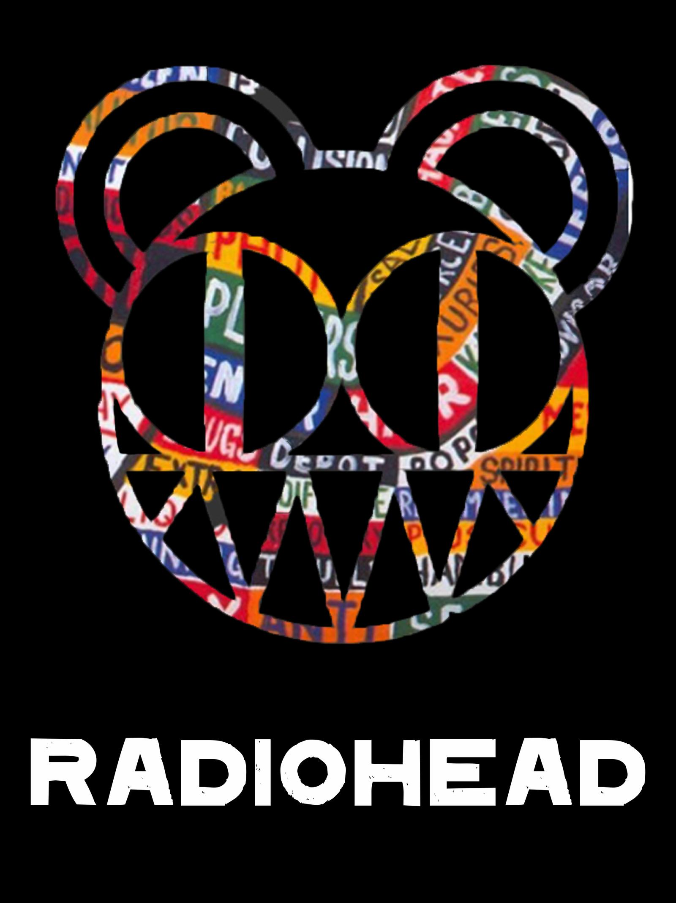
                        <div class="song-item__info">
                            <h4 class="song-item__title">Creep</h4>
                            <p class="song-item__artist">Radiohead</p>
                        </div>
                        <span class="song-item__duration">3:58</span>
                        <button class="song-item__add">+</button>
                    </div>

                    <div class="song-item">
                        
                        <div class="song-item__info">
                            <h4 class="song-item__title">La Plata</h4>
                            <p class="song-item__artist">Diomedes Diaz</p>
                        </div>
                        <span class="song-item__duration">4:38</span>
                        <button class="song-item__add">+</button>
                    </div>

                    <div class="song-item">
                        
                        <div class="song-item__info">
                            <h4 class="song-item__title">Collar Of Truth</h4>
                            <p class="song-item__artist">Violent Vira</p>
                        </div>
                        <span class="song-item__duration">3:07</span>
                        <button class="song-item__add">+</button>
                    </div>

                    <div class="song-item">
                        
                        <div class="song-item__info">
                            <h4 class="song-item__title">El Santo Cachón</h4>
                            <p class="song-item__artist">Diomedes Diaz</p>
                        </div>
                        <span class="song-item__duration">5:02</span>
                        <button class="song-item__add">+</button>
                    </div>
                </div>
            </section>

            <!-- Selected Songs -->
            <section class="selected-songs-section">
                <h2 class="section__title">Canciones Seleccionadas <span class="song-count">(0)</span></h2>
                <div class="selected-songs-list">
                    <p class="empty-message">No has agregado canciones aún</p>
                </div>
            </section>
        </main>
    </div>
</body>
</html>
```

```
/* playlist-create.css */
:root {
    --bg-body: #0f172a;
    --bg-header: #161920;
    --bg-card: #1e293b;
    --bg-card-hover: #252932;
    --primary-blue: #2962ff;
    --primary-blue-light: rgba(41, 98, 255, 0.15);
    --text-main: #ffffff;
    --text-secondary: #94a3b8;
    --border-color: #2a2e38;
    --header-height: 80px;
    --sidebar-width: 240px;
    --radius-lg: 24px;
    --radius-md: 16px;
    --radius-sm: 8px;
}

* {
    margin: 0;
    padding: 0;
    box-sizing: border-box;
}

body {
    font-family: 'Inter', system-ui, -apple-system, sans-serif;
    background-color: var(--bg-body);
    color: var(--text-main);
    line-height: 1.6;
    overflow-x: hidden;
    width: 100%;
    min-width: 320px;
}

a { text-decoration: none; color: inherit; }
ul { list-style: none; }
img { max-width: 100%; display: block; }
button { border: none; background: none; cursor: pointer; font-family: inherit; }

/* Header & Sidebar (Same as other pages) */
.header {
    position: sticky;
    top: 0;
    z-index: 1000;
    background-color: var(--bg-header);
    border-bottom: 1px solid var(--border-color);
    min-height: var(--header-height);
    display: flex;
    align-items: center;
    padding: 0.75rem 1.5rem;
    width: 100%;
}

.header__container {
    width: 100%;
    max-width: 1600px;
    margin: 0 auto;
    display: flex;
    align-items: center;
    gap: 2rem;
}

.header__logo {
    display: flex;
    align-items: center;
    gap: 10px;
    flex-shrink: 0;
}

.logo {
    height: 32px;
    width: auto;
}

.header__logo-text {
    font-size: 1.25rem;
    font-weight: 700;
    white-space: nowrap;
}

.header__nav {
    display: flex;
    margin-left: auto;
}

.nav__list {
    display: flex;
    gap: 2.5rem;
}

.nav__link {
    font-size: 0.95rem;
    font-weight: 500;
    color: var(--text-secondary);
    padding: 10px 0;
    transition: color 0.3s ease;
    display: block;
    position: relative;
}

.nav__link::after {
    content: '';
    position: absolute;
    bottom: -5px;
    left: 0;
    width: 0;
    height: 3px;
    background-color: var(--primary-blue);
    border-radius: 3px 3px 0 0;
    transition: width 0.3s cubic-bezier(0.4, 0, 0.2, 1);
}

.nav__link:hover,
.nav__link--active {
    color: var(--text-main);
}

.nav__link:hover::after {
    width: 100%;
}

.header__search {
    flex-grow: 1;
    max-width: 400px;
    background-color: #232730;
    border-radius: 50px;
    padding: 0.5rem 1rem;
    display: flex;
    align-items: center;
    margin-left: 2rem;
}

.search__button {
    background: none;
    border: none;
    margin-right: 10px;
    padding: 0;
}

.search__icon {
    width: 20px;
    height: 20px;
    filter: invert(1);
    opacity: 0.7;
}

.search__input {
    background: transparent;
    border: none;
    color: white;
    width: 100%;
    outline: none;
    font-size: 0.9rem;
}

.search__input::placeholder {
    color: var(--text-secondary);
}

.header__user {
    margin-left: 1rem;
}

.user__avatar {
    width: 40px;
    height: 40px;
    border-radius: 50%;
    overflow: hidden;
    border: 2px solid var(--border-color);
    cursor: pointer;
    transition: border-color 0.3s ease;
}

.user__avatar:hover {
    border-color: var(--primary-blue);
}

.user__avatar-img {
    width: 100%;
    height: 100%;
    object-fit: cover;
}

/* Layout */
.main-wrapper {
    display: flex;
    max-width: 1600px;
    margin: 0 auto;
    min-height: calc(100vh - var(--header-height));
    width: 100%;
}

.sidebar {
    width: var(--sidebar-width);
    flex-shrink: 0;
    padding: 2rem 1rem;
    border-right: 1px solid var(--border-color);
    overflow-y: auto;
    height: calc(100vh - var(--header-height));
    position: sticky;
    top: var(--header-height);
}

.sidebar__title {
    font-size: 0.75rem;
    font-weight: 700;
    color: var(--text-secondary);
    margin-bottom: 1.5rem;
    text-transform: uppercase;
    letter-spacing: 1px;
    padding-left: 16px;
}

.sidebar__menu {
    display: flex;
    flex-direction: column;
    gap: 0.5rem;
}

.sidebar__link {
    display: flex;
    align-items: center;
    gap: 12px;
    padding: 12px 16px;
    border-radius: 12px;
    color: var(--text-main);
    font-weight: 500;
    transition: all 0.3s cubic-bezier(0.4, 0, 0.2, 1);
    background-color: transparent;
}

.sidebar__link:hover,
.sidebar__link--active {
    background-color: var(--primary-blue-light);
    color: var(--primary-blue);
    transform: translateX(5px);
}

.link__icon {
    width: 20px;
    height: 20px;
    flex-shrink: 0;
    filter: invert(1);
    transition: all 0.3s ease;
}

/* Content */
.content {
    flex-grow: 1;
    padding: 2rem;
    width: 100%;
}

/* Playlist Header */
.playlist-header {
    margin-bottom: 3rem;
}

.page-title {
    font-size: 2.5rem;
    font-weight: 800;
    color: var(--text-main);
    margin-bottom: 0.5rem;
}

.page-subtitle {
    font-size: 1.1rem;
    color: var(--text-secondary);
}

/* Playlist Form Section */
.playlist-form-section {
    margin-bottom: 4rem;
}

.playlist-form {
    background-color: var(--bg-card);
    border-radius: var(--radius-lg);
    padding: 2.5rem;
    border: 1px solid var(--border-color);
}

/* Cover Upload */
.playlist-cover-upload {
    display: flex;
    flex-direction: column;
    align-items: center;
    margin-bottom: 2rem;
}

.cover-preview {
    position: relative;
    width: 200px;
    height: 200px;
    border-radius: var(--radius-md);
    overflow: hidden;
    margin-bottom: 1rem;
    cursor: pointer;
}

.cover-preview__image {
    width: 100%;
    height: 100%;
    object-fit: cover;
}

.cover-preview__change {
    position: absolute;
    bottom: 10px;
    right: 10px;
    width: 40px;
    height: 40px;
    border-radius: 50%;
    background-color: var(--primary-blue);
    color: white;
    font-size: 1.2rem;
    display: flex;
    align-items: center;
    justify-content: center;
    transition: all 0.3s ease;
}

.cover-preview__change:hover {
    transform: scale(1.1);
}

.cover-preview__text {
    font-size: 0.9rem;
    color: var(--text-secondary);
}

/* Form Groups */
.form-group {
    margin-bottom: 1.5rem;
}

.form-label {
    display: block;
    font-size: 0.9rem;
    font-weight: 600;
    color: var(--text-main);
    margin-bottom: 0.5rem;
}

.form-input,
.form-textarea,
.form-select {
    width: 100%;
    padding: 0.875rem 1rem;
    background-color: var(--bg-body);
    border: 1px solid var(--border-color);
    border-radius: var(--radius-sm);
    color: var(--text-main);
    font-size: 1rem;
    font-family: inherit;
    transition: all 0.3s ease;
}

.form-input:focus,
.form-textarea:focus,
.form-select:focus {
    outline: none;
    border-color: var(--primary-blue);
    box-shadow: 0 0 0 3px rgba(41, 98, 255, 0.1);
}

.form-textarea {
    resize: vertical;
    min-height: 100px;
}

.form-select {
    cursor: pointer;
}

/* Form Actions */
.form-actions {
    display: flex;
    gap: 1rem;
    margin-top: 2rem;
}

.btn {
    display: inline-flex;
    align-items: center;
    justify-content: center;
    padding: 0.875rem 2rem;
    border-radius: 50px;
    font-weight: 600;
    font-size: 1rem;
    transition: all 0.3s ease;
}

.btn--primary {
    background-color: var(--primary-blue);
    color: white;
    box-shadow: 0 4px 15px rgba(41, 98, 255, 0.4);
}

.btn--primary:hover {
    background-color: #1e4bd1;
    transform: translateY(-2px);
}

.btn--secondary {
    background-color: var(--bg-card);
    color: var(--text-main);
    border: 1px solid var(--border-color);
}

.btn--secondary:hover {
    background-color: var(--bg-card-hover);
}

/* Add Songs Section */
.add-songs-section {
    margin-bottom: 4rem;
}

.section__title {
    font-size: 1.75rem;
    font-weight: 700;
    margin-bottom: 1.5rem;
    color: var(--text-main);
}

.song-count {
    font-size: 1rem;
    font-weight: 500;
    color: var(--text-secondary);
}

/* Search Songs */
.search-songs {
    margin-bottom: 1.5rem;
}

.search-songs__input {
    display: flex;
    align-items: center;
    background-color: var(--bg-card);
    border-radius: 50px;
    padding: 0.75rem 1.25rem;
    border: 1px solid var(--border-color);
}

.search-songs__icon {
    width: 20px;
    height: 20px;
    filter: invert(1);
    opacity: 0.7;
    margin-right: 10px;
}

.search-songs__field {
    background: transparent;
    border: none;
    color: var(--text-main);
    width: 100%;
    outline: none;
    font-size: 0.95rem;
}

/* Songs List */
.songs-list {
    display: flex;
    flex-direction: column;
    gap: 0.75rem;
}

.song-item {
    display: grid;
    grid-template-columns: 60px 1fr auto auto;
    gap: 1rem;
    align-items: center;
    padding: 1rem;
    background-color: var(--bg-card);
    border-radius: var(--radius-sm);
    border: 1px solid var(--border-color);
    transition: all 0.3s ease;
}

.song-item:hover {
    border-color: var(--primary-blue);
    transform: translateX(5px);
}

.song-item__image {
    width: 60px;
    height: 60px;
    border-radius: var(--radius-sm);
    object-fit: cover;
}

.song-item__info {
    display: flex;
    flex-direction: column;
    gap: 0.25rem;
}

.song-item__title {
    font-size: 1rem;
    font-weight: 700;
    color: var(--text-main);
}

.song-item__artist {
    font-size: 0.85rem;
    color: var(--text-secondary);
}

.song-item__duration {
    font-size: 0.85rem;
    color: var(--text-secondary);
}

.song-item__add {
    width: 36px;
    height: 36px;
    border-radius: 50%;
    background-color: var(--primary-blue);
    color: white;
    font-size: 1.5rem;
    display: flex;
    align-items: center;
    justify-content: center;
    transition: all 0.3s ease;
}

.song-item__add:hover {
    transform: scale(1.1);
    background-color: #1e4bd1;
}

/* Selected Songs */
.selected-songs-section {
    margin-bottom: 2rem;
}

.selected-songs-list {
    background-color: var(--bg-card);
    border-radius: var(--radius-md);
    padding: 2rem;
    border: 1px solid var(--border-color);
    text-align: center;
}

.empty-message {
    color: var(--text-secondary);
    font-size: 1rem;
}

/* Responsive */
@media (max-width: 1024px) {
    .sidebar {
        width: 80px;
        padding: 2rem 0.5rem;
    }
    .sidebar__title,
    .link__text {
        display: none;
    }
    .sidebar__link {
        justify-content: center;
        padding: 12px;
    }
}

@media (max-width: 768px) {
    .main-wrapper {
        flex-direction: column;
    }
    .sidebar {
        width: 100%;
        height: auto;
        position: relative;
        top: 0;
        border-right: none;
        border-bottom: 1px solid var(--border-color);
        padding: 1rem;
        overflow-x: auto;
        overflow-y: hidden;
    }
    .sidebar__menu {
        flex-direction: row;
        gap: 0.75rem;
        width: max-content;
    }
    .sidebar__link {
        flex-direction: column;
        align-items: center;
        gap: 6px;
        padding: 10px 16px;
        min-width: 70px;
    }
    .link__text {
        font-size: 0.75rem;
        white-space: nowrap;
    }
    .content {
        padding: 1.5rem;
    }
    .playlist-form {
        padding: 1.5rem;
    }
    .song-item {
        grid-template-columns: 50px 1fr auto;
    }
    .song-item__duration {
        display: none;
    }
}

@media (max-width: 480px) {
    .header {
        padding: 0.5rem 0.75rem;
    }
    .header__logo-text {
        font-size: 1rem;
    }
    .logo {
        height: 28px;
    }
    .header__search {
        margin-left: 0;
        margin-top: 0.5rem;
        width: 100%;
        max-width: 100%;
    }
    .content {
        padding: 1rem;
    }
    .page-title {
        font-size: 1.75rem;
    }
    .playlist-form {
        padding: 1.25rem;
    }
    .cover-preview {
        width: 150px;
        height: 150px;
    }
    .form-actions {
        flex-direction: column;
    }
    .btn {
        width: 100%;
    }
    .song-item {
        grid-template-columns: 45px 1fr auto;
    }
    .song-item__image {
        width: 45px;
        height: 45px;
    }
}

/* Animations */
@keyframes fadeIn {
    from { opacity: 0; transform: translateY(20px); }
    to { opacity: 1; transform: translateY(0); }
}

.playlist-form,
.add-songs-section,
.selected-songs-section {
    animation: fadeIn 0.5s ease forwards;
}

.add-songs-section { animation-delay: 0.1s; }
.selected-songs-section { animation-delay: 0.2s; }
```

perfil de artista

```
<!DOCTYPE html>
<html lang="es">
<head>
    <meta charset="UTF-8">
    <meta name="viewport" content="width=device-width, initial-scale=1.0">
    <title>Metallica | MusicStream</title>
    <link rel="stylesheet" href="CSS/views/artist-profile.css">
    <link rel="icon" href="./assets/icons/favico.ico" type="image/png">
</head>
<body>
    <!-- Header -->
    <header class="header">
        <div class="header__container">
            <div class="header__logo">
                
                <span class="header__logo-text">MusicStream</span>
            </div>
            <nav class="header__nav">
                <ul class="nav__list">
                    <li class="nav__item">
                        <a href="discover.html" class="nav__link">Discover</a>
                    </li>
                    <li class="nav__item">
                        <a href="library.html" class="nav__link">Library</a>
                    </li>
                    <li class="nav__item">
                        <a href="index.html" class="nav__link">Store</a>
                    </li>
                </ul>
            </nav>
            <div class="header__search">
                <button class="search__button">
                    
                </button>
                <input type="search" class="search__input" placeholder=" | Artists, albums, tracks">
            </div>
            <div class="header__user">
                <div class="user__avatar">
                    
                </div>
            </div>
        </div>
    </header>

    <!-- Artist Hero -->
    <section class="artist-hero">
        <div class="artist-hero__background">
            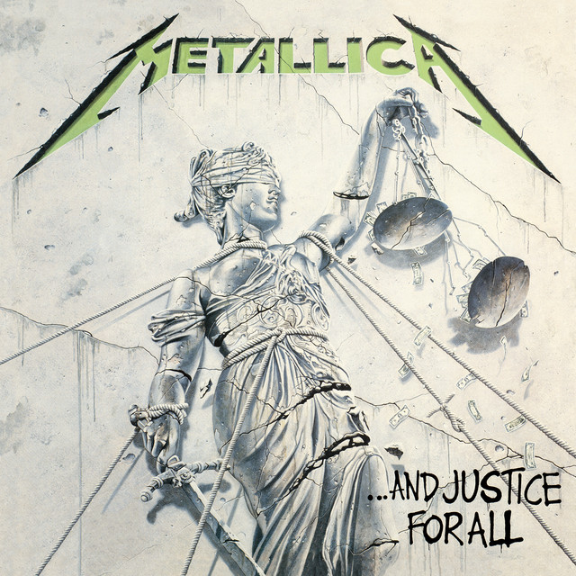
            <div class="artist-hero__overlay"></div>
        </div>
        <div class="artist-hero__content">
            <div class="artist-hero__info">
                <span class="artist-hero__verified">✓ Artista Verificado</span>
                <h1 class="artist-hero__name">Metallica</h1>
                <p class="artist-hero__followers">25.4M Seguidores</p>
                <div class="artist-hero__actions">
                    <button class="btn btn--primary btn--large">Seguir</button>
                    <button class="btn btn--secondary">Compartir</button>
                </div>
            </div>
        </div>
    </section>

    <div class="main-wrapper">
        <!-- Sidebar -->
        <aside class="sidebar">
            <h2 class="sidebar__title">NAVEGACIÓN</h2>
            <nav class="sidebar__nav">
                <ul class="sidebar__menu">
                    <li class="sidebar__menu-item">
                        <a href="artist-profile.html" class="sidebar__link sidebar__link--active">
                            
                            <span class="link__text">Perfil</span>
                        </a>
                    </li>
                    <li class="sidebar__menu-item">
                        <a href="#" class="sidebar__link">
                            
                            <span class="link__text">Álbumes</span>
                        </a>
                    </li>
                    <li class="sidebar__menu-item">
                        <a href="#" class="sidebar__link">
                            
                            <span class="link__text">Canciones</span>
                        </a>
                    </li>
                    <li class="sidebar__menu-item">
                        <a href="#" class="sidebar__link">
                            
                            <span class="link__text">Fans También Gustan</span>
                        </a>
                    </li>
                </ul>
            </nav>
        </aside>

        <!-- Main Content -->
        <main class="content">
            <!-- Popular Songs -->
            <section class="artist-section">
                <h2 class="section__title">Canciones Populares</h2>
                <div class="popular-songs">
                    <div class="song-row">
                        <span class="song-row__number">1</span>
                        
                        <div class="song-row__info">
                            <h4 class="song-row__title">One</h4>
                            <p class="song-row__album">...And Justice For All</p>
                        </div>
                        <span class="song-row__plays">5.2M</span>
                        <button class="song-row__play">▶</button>
                    </div>

                    <div class="song-row">
                        <span class="song-row__number">2</span>
                        
                        <div class="song-row__info">
                            <h4 class="song-row__title">Enter Sandman</h4>
                            <p class="song-row__album">Metallica</p>
                        </div>
                        <span class="song-row__plays">4.8M</span>
                        <button class="song-row__play">▶</button>
                    </div>

                    <div class="song-row">
                        <span class="song-row__number">3</span>
                        
                        <div class="song-row__info">
                            <h4 class="song-row__title">Master of Puppets</h4>
                            <p class="song-row__album">Master of Puppets</p>
                        </div>
                        <span class="song-row__plays">4.5M</span>
                        <button class="song-row__play">▶</button>
                    </div>

                    <div class="song-row">
                        <span class="song-row__number">4</span>
                        
                        <div class="song-row__info">
                            <h4 class="song-row__title">Nothing Else Matters</h4>
                            <p class="song-row__album">Metallica</p>
                        </div>
                        <span class="song-row__plays">4.2M</span>
                        <button class="song-row__play">▶</button>
                    </div>

                    <div class="song-row">
                        <span class="song-row__number">5</span>
                        
                        <div class="song-row__info">
                            <h4 class="song-row__title">The Unforgiven</h4>
                            <p class="song-row__album">Metallica</p>
                        </div>
                        <span class="song-row__plays">3.9M</span>
                        <button class="song-row__play">▶</button>
                    </div>
                </div>
            </section>

            <!-- Albums -->
            <section class="artist-section">
                <h2 class="section__title">Álbumes</h2>
                <div class="albums-grid">
                    <article class="album-card">
                        <div class="album-card__image">
                            
                        </div>
                        <div class="album-card__info">
                            <h3 class="album-card__title">...And Justice For All</h3>
                            <p class="album-card__year">1988</p>
                        </div>
                        <a href="album-detail2.html" class="album-card__link">Ver</a>
                    </article>

                    <article class="album-card">
                        <div class="album-card__image">
                            
                        </div>
                        <div class="album-card__info">
                            <h3 class="album-card__title">Metallica</h3>
                            <p class="album-card__year">1991</p>
                        </div>
                        <a href="album-detail2.html" class="album-card__link">Ver</a>
                    </article>

                    <article class="album-card">
                        <div class="album-card__image">
                            
                        </div>
                        <div class="album-card__info">
                            <h3 class="album-card__title">Master of Puppets</h3>
                            <p class="album-card__year">1986</p>
                        </div>
                        <a href="album-detail2.html" class="album-card__link">Ver</a>
                    </article>

                    <article class="album-card">
                        <div class="album-card__image">
                            
                        </div>
                        <div class="album-card__info">
                            <h3 class="album-card__title">Ride the Lightning</h3>
                            <p class="album-card__year">1984</p>
                        </div>
                        <a href="album-detail2.html" class="album-card__link">Ver</a>
                    </article>
                </div>
            </section>

            <!-- About -->
            <section class="artist-section">
                <h2 class="section__title">Acerca de</h2>
                <div class="about-card">
                    <p class="about-card__text">
                        Considerada una de las figuras definitivas del "Big Four" del thrash metal, Metallica ha moldeado 
                        el sonido del rock pesado durante más de cuatro décadas. Con una trayectoria que abarca desde la 
                        velocidad técnica de los 80 hasta el éxito masivo global, la banda liderada por James Hetfield y 
                        Lars Ulrich combina riffs icónicos, una energía imparable en directo y un legado que los posiciona 
                        como leyendas vivientes del género.
                    </p>
                    <div class="about-card__stats">
                        <div class="stat-box">
                            <span class="stat-box__number">40+</span>
                            <span class="stat-box__label">Años de Carrera</span>
                        </div>
                        <div class="stat-box">
                            <span class="stat-box__number">10</span>
                            <span class="stat-box__label">Álbumes de Estudio</span>
                        </div>
                        <div class="stat-box">
                            <span class="stat-box__number">9</span>
                            <span class="stat-box__label">Grammy Awards</span>
                        </div>
                        <div class="stat-box">
                            <span class="stat-box__number">25.4M</span>
                            <span class="stat-box__label">Seguidores</span>
                        </div>
                    </div>
                </div>
            </section>

            <!-- Related Artists -->
            <section class="artist-section">
                <h2 class="section__title">Fans También Gustan</h2>
                <div class="related-artists">
                    <article class="related-artist-card">
                        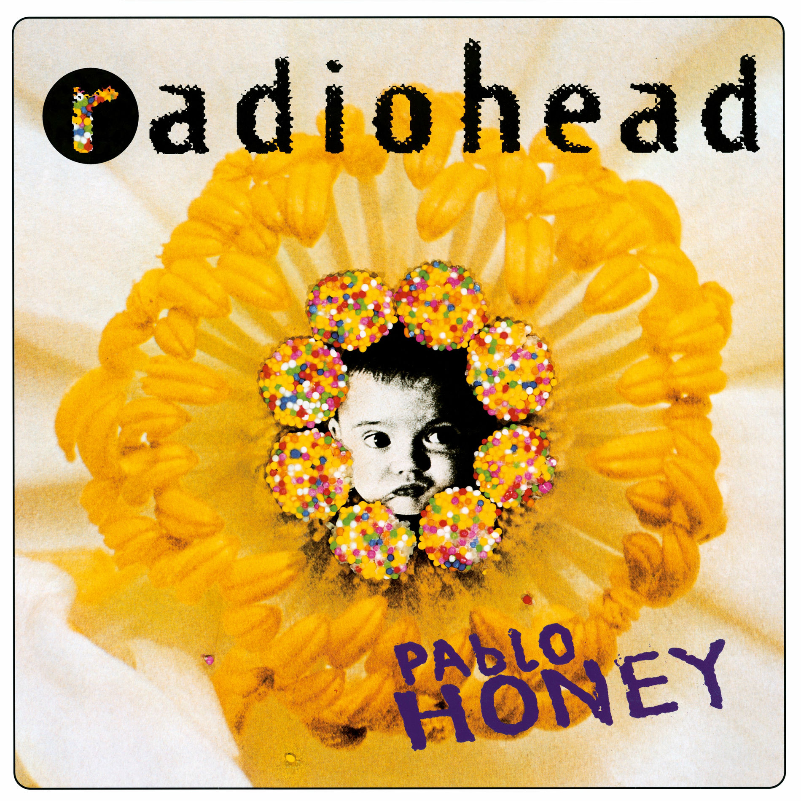
                        <h4 class="related-artist-card__name">Radiohead</h4>
                        <p class="related-artist-card__genre">Alternative Rock</p>
                    </article>

                    <article class="related-artist-card">
                        
                        <h4 class="related-artist-card__name">Violent Vira</h4>
                        <p class="related-artist-card__genre">Alternative Rock</p>
                    </article>

                    <article class="related-artist-card">
                        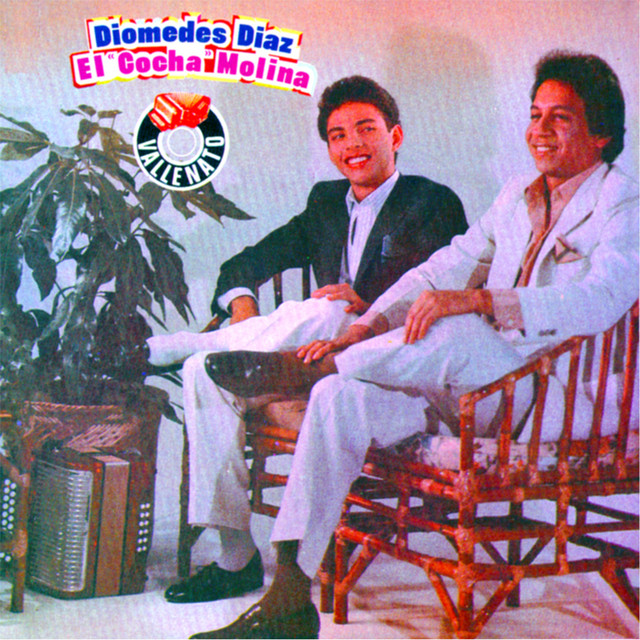
                        <h4 class="related-artist-card__name">Diomedes Diaz</h4>
                        <p class="related-artist-card__genre">Vallenato</p>
                    </article>
                </div>
            </section>
        </main>
    </div>
</body>
</html>
```

```
/* artist-profile.css */
:root {
    --bg-body: #0f172a;
    --bg-header: #161920;
    --bg-card: #1e293b;
    --bg-card-hover: #252932;
    --primary-blue: #2962ff;
    --primary-blue-light: rgba(41, 98, 255, 0.15);
    --text-main: #ffffff;
    --text-secondary: #94a3b8;
    --border-color: #2a2e38;
    --header-height: 80px;
    --sidebar-width: 240px;
    --radius-lg: 24px;
    --radius-md: 16px;
    --radius-sm: 8px;
}

* {
    margin: 0;
    padding: 0;
    box-sizing: border-box;
}

body {
    font-family: 'Inter', system-ui, -apple-system, sans-serif;
    background-color: var(--bg-body);
    color: var(--text-main);
    line-height: 1.6;
    overflow-x: hidden;
    width: 100%;
    min-width: 320px;
}

a { text-decoration: none; color: inherit; }
ul { list-style: none; }
img { max-width: 100%; display: block; }
button { border: none; background: none; cursor: pointer; font-family: inherit; }

/* Header & Sidebar (Same as other pages) */
.header {
    position: sticky;
    top: 0;
    z-index: 1000;
    background-color: var(--bg-header);
    border-bottom: 1px solid var(--border-color);
    min-height: var(--header-height);
    display: flex;
    align-items: center;
    padding: 0.75rem 1.5rem;
    width: 100%;
}

.header__container {
    width: 100%;
    max-width: 1600px;
    margin: 0 auto;
    display: flex;
    align-items: center;
    gap: 2rem;
}

.header__logo {
    display: flex;
    align-items: center;
    gap: 10px;
    flex-shrink: 0;
}

.logo {
    height: 32px;
    width: auto;
}

.header__logo-text {
    font-size: 1.25rem;
    font-weight: 700;
    white-space: nowrap;
}

.header__nav {
    display: flex;
    margin-left: auto;
}

.nav__list {
    display: flex;
    gap: 2.5rem;
}

.nav__link {
    font-size: 0.95rem;
    font-weight: 500;
    color: var(--text-secondary);
    padding: 10px 0;
    transition: color 0.3s ease;
    display: block;
    position: relative;
}

.nav__link::after {
    content: '';
    position: absolute;
    bottom: -5px;
    left: 0;
    width: 0;
    height: 3px;
    background-color: var(--primary-blue);
    border-radius: 3px 3px 0 0;
    transition: width 0.3s cubic-bezier(0.4, 0, 0.2, 1);
}

.nav__link:hover,
.nav__link--active {
    color: var(--text-main);
}

.nav__link:hover::after {
    width: 100%;
}

.header__search {
    flex-grow: 1;
    max-width: 400px;
    background-color: #232730;
    border-radius: 50px;
    padding: 0.5rem 1rem;
    display: flex;
    align-items: center;
    margin-left: 2rem;
}

.search__button {
    background: none;
    border: none;
    margin-right: 10px;
    padding: 0;
}

.search__icon {
    width: 20px;
    height: 20px;
    filter: invert(1);
    opacity: 0.7;
}

.search__input {
    background: transparent;
    border: none;
    color: white;
    width: 100%;
    outline: none;
    font-size: 0.9rem;
}

.search__input::placeholder {
    color: var(--text-secondary);
}

.header__user {
    margin-left: 1rem;
}

.user__avatar {
    width: 40px;
    height: 40px;
    border-radius: 50%;
    overflow: hidden;
    border: 2px solid var(--border-color);
    cursor: pointer;
    transition: border-color 0.3s ease;
}

.user__avatar:hover {
    border-color: var(--primary-blue);
}

.user__avatar-img {
    width: 100%;
    height: 100%;
    object-fit: cover;
}

/* Layout */
.main-wrapper {
    display: flex;
    max-width: 1600px;
    margin: 0 auto;
    min-height: calc(100vh - var(--header-height));
    width: 100%;
}

.sidebar {
    width: var(--sidebar-width);
    flex-shrink: 0;
    padding: 2rem 1rem;
    border-right: 1px solid var(--border-color);
    overflow-y: auto;
    height: calc(100vh - var(--header-height));
    position: sticky;
    top: var(--header-height);
}

.sidebar__title {
    font-size: 0.75rem;
    font-weight: 700;
    color: var(--text-secondary);
    margin-bottom: 1.5rem;
    text-transform: uppercase;
    letter-spacing: 1px;
    padding-left: 16px;
}

.sidebar__menu {
    display: flex;
    flex-direction: column;
    gap: 0.5rem;
}

.sidebar__link {
    display: flex;
    align-items: center;
    gap: 12px;
    padding: 12px 16px;
    border-radius: 12px;
    color: var(--text-main);
    font-weight: 500;
    transition: all 0.3s cubic-bezier(0.4, 0, 0.2, 1);
    background-color: transparent;
}

.sidebar__link:hover,
.sidebar__link--active {
    background-color: var(--primary-blue-light);
    color: var(--primary-blue);
    transform: translateX(5px);
}

.link__icon {
    width: 20px;
    height: 20px;
    flex-shrink: 0;
    filter: invert(1);
    transition: all 0.3s ease;
}

/* Content */
.content {
    flex-grow: 1;
    padding: 2rem;
    width: 100%;
}

/* Artist Hero */
.artist-hero {
    position: relative;
    height: 400px;
    display: flex;
    align-items: flex-end;
    overflow: hidden;
}

.artist-hero__background {
    position: absolute;
    inset: 0;
    z-index: 0;
}

.artist-hero__bg-image {
    width: 100%;
    height: 100%;
    object-fit: cover;
    filter: brightness(0.5);
}

.artist-hero__overlay {
    position: absolute;
    inset: 0;
    background: linear-gradient(0deg, var(--bg-body) 0%, transparent 100%);
}

.artist-hero__content {
    position: relative;
    z-index: 1;
    width: 100%;
    max-width: 1600px;
    margin: 0 auto;
    padding: 2rem;
}

.artist-hero__info {
    display: flex;
    flex-direction: column;
    gap: 1rem;
}

.artist-hero__verified {
    display: inline-block;
    background-color: var(--primary-blue);
    color: white;
    padding: 0.5rem 1rem;
    border-radius: 50px;
    font-size: 0.85rem;
    font-weight: 600;
    width: fit-content;
}

.artist-hero__name {
    font-size: 4rem;
    font-weight: 900;
    color: var(--text-main);
    line-height: 1.1;
}

.artist-hero__followers {
    font-size: 1.25rem;
    color: var(--text-secondary);
}

.artist-hero__actions {
    display: flex;
    gap: 1rem;
    margin-top: 1rem;
}

.btn {
    display: inline-flex;
    align-items: center;
    justify-content: center;
    padding: 0.875rem 2rem;
    border-radius: 50px;
    font-weight: 600;
    font-size: 1rem;
    transition: all 0.3s ease;
}

.btn--primary {
    background-color: var(--primary-blue);
    color: white;
    box-shadow: 0 4px 15px rgba(41, 98, 255, 0.4);
}

.btn--primary:hover {
    background-color: #1e4bd1;
    transform: translateY(-2px);
}

.btn--secondary {
    background-color: var(--bg-card);
    color: var(--text-main);
    border: 1px solid var(--border-color);
}

.btn--secondary:hover {
    background-color: var(--bg-card-hover);
}

.btn--large {
    padding: 1rem 2.5rem;
    font-size: 1.05rem;
}

/* Artist Sections */
.artist-section {
    margin-bottom: 4rem;
}

.section__title {
    font-size: 1.75rem;
    font-weight: 700;
    margin-bottom: 1.5rem;
    color: var(--text-main);
}

/* Popular Songs */
.popular-songs {
    display: flex;
    flex-direction: column;
    gap: 0.75rem;
}

.song-row {
    display: grid;
    grid-template-columns: 40px 60px 1fr 100px 50px;
    gap: 1rem;
    align-items: center;
    padding: 1rem;
    background-color: var(--bg-card);
    border-radius: var(--radius-sm);
    border: 1px solid var(--border-color);
    transition: all 0.3s ease;
}

.song-row:hover {
    border-color: var(--primary-blue);
    transform: translateX(5px);
}

.song-row__number {
    font-size: 1.25rem;
    font-weight: 700;
    color: var(--text-secondary);
}

.song-row__image {
    width: 60px;
    height: 60px;
    border-radius: var(--radius-sm);
    object-fit: cover;
}

.song-row__info {
    display: flex;
    flex-direction: column;
    gap: 0.25rem;
}

.song-row__title {
    font-size: 1rem;
    font-weight: 700;
    color: var(--text-main);
}

.song-row__album {
    font-size: 0.85rem;
    color: var(--text-secondary);
}

.song-row__plays {
    font-size: 0.9rem;
    color: var(--text-secondary);
    text-align: right;
}

.song-row__play {
    width: 40px;
    height: 40px;
    border-radius: 50%;
    background-color: var(--primary-blue);
    color: white;
    font-size: 1rem;
    display: flex;
    align-items: center;
    justify-content: center;
    transition: all 0.3s ease;
}

.song-row__play:hover {
    transform: scale(1.1);
    background-color: #1e4bd1;
}

/* Albums Grid */
.albums-grid {
    display: grid;
    grid-template-columns: repeat(auto-fill, minmax(200px, 1fr));
    gap: 1.5rem;
}

.album-card {
    background-color: var(--bg-card);
    border-radius: var(--radius-md);
    padding: 1rem;
    border: 1px solid var(--border-color);
    transition: all 0.3s ease;
}

.album-card:hover {
    border-color: var(--primary-blue);
    transform: translateY(-5px);
}

.album-card__image {
    width: 100%;
    aspect-ratio: 1/1;
    border-radius: var(--radius-sm);
    overflow: hidden;
    margin-bottom: 1rem;
}

.album-card__thumbnail {
    width: 100%;
    height: 100%;
    object-fit: cover;
    transition: transform 0.5s ease;
}

.album-card:hover .album-card__thumbnail {
    transform: scale(1.05);
}

.album-card__info {
    display: flex;
    flex-direction: column;
    gap: 0.25rem;
    margin-bottom: 1rem;
}

.album-card__title {
    font-size: 1rem;
    font-weight: 700;
    color: var(--text-main);
}

.album-card__year {
    font-size: 0.85rem;
    color: var(--text-secondary);
}

.album-card__link {
    display: block;
    padding: 0.75rem;
    background-color: rgba(41, 98, 255, 0.1);
    color: var(--primary-blue);
    border-radius: 50px;
    text-align: center;
    font-weight: 600;
    font-size: 0.9rem;
    transition: all 0.3s ease;
}

.album-card__link:hover {
    background-color: var(--primary-blue);
    color: white;
}

/* About Card */
.about-card {
    background-color: var(--bg-card);
    border-radius: var(--radius-lg);
    padding: 2rem;
    border: 1px solid var(--border-color);
}

.about-card__text {
    font-size: 1rem;
    color: var(--text-secondary);
    line-height: 1.8;
    margin-bottom: 2rem;
}

.about-card__stats {
    display: grid;
    grid-template-columns: repeat(auto-fit, minmax(150px, 1fr));
    gap: 1.5rem;
}

.stat-box {
    display: flex;
    flex-direction: column;
    align-items: center;
    padding: 1.5rem;
    background-color: var(--bg-body);
    border-radius: var(--radius-md);
    border: 1px solid var(--border-color);
}

.stat-box__number {
    font-size: 2rem;
    font-weight: 800;
    color: var(--primary-blue);
    margin-bottom: 0.5rem;
}

.stat-box__label {
    font-size: 0.85rem;
    color: var(--text-secondary);
    text-align: center;
}

/* Related Artists */
.related-artists {
    display: grid;
    grid-template-columns: repeat(auto-fill, minmax(200px, 1fr));
    gap: 1.5rem;
}

.related-artist-card {
    background-color: var(--bg-card);
    border-radius: var(--radius-md);
    padding: 1.5rem;
    border: 1px solid var(--border-color);
    text-align: center;
    transition: all 0.3s ease;
}

.related-artist-card:hover {
    border-color: var(--primary-blue);
    transform: translateY(-5px);
}

.related-artist-card__image {
    width: 120px;
    height: 120px;
    border-radius: 50%;
    object-fit: cover;
    margin: 0 auto 1rem;
    border: 3px solid var(--border-color);
}

.related-artist-card__name {
    font-size: 1.1rem;
    font-weight: 700;
    color: var(--text-main);
    margin-bottom: 0.5rem;
}

.related-artist-card__genre {
    font-size: 0.85rem;
    color: var(--text-secondary);
}

/* Responsive */
@media (max-width: 1024px) {
    .sidebar {
        width: 80px;
        padding: 2rem 0.5rem;
    }
    .sidebar__title,
    .link__text {
        display: none;
    }
    .sidebar__link {
        justify-content: center;
        padding: 12px;
    }
    .artist-hero__name {
        font-size: 3rem;
    }
}

@media (max-width: 768px) {
    .main-wrapper {
        flex-direction: column;
    }
    .sidebar {
        width: 100%;
        height: auto;
        position: relative;
        top: 0;
        border-right: none;
        border-bottom: 1px solid var(--border-color);
        padding: 1rem;
        overflow-x: auto;
        overflow-y: hidden;
    }
    .sidebar__menu {
        flex-direction: row;
        gap: 0.75rem;
        width: max-content;
    }
    .sidebar__link {
        flex-direction: column;
        align-items: center;
        gap: 6px;
        padding: 10px 16px;
        min-width: 70px;
    }
    .link__text {
        font-size: 0.75rem;
        white-space: nowrap;
    }
    .content {
        padding: 1.5rem;
    }
    .artist-hero {
        height: 300px;
    }
    .artist-hero__name {
        font-size: 2.5rem;
    }
    .song-row {
        grid-template-columns: 35px 50px 1fr 45px;
    }
    .song-row__plays {
        display: none;
    }
    .albums-grid {
        grid-template-columns: repeat(2, 1fr);
    }
}

@media (max-width: 480px) {
    .header {
        padding: 0.5rem 0.75rem;
    }
    .header__logo-text {
        font-size: 1rem;
    }
    .logo {
        height: 28px;
    }
    .header__search {
        margin-left: 0;
        margin-top: 0.5rem;
        width: 100%;
        max-width: 100%;
    }
    .content {
        padding: 1rem;
    }
    .artist-hero {
        height: 250px;
    }
    .artist-hero__name {
        font-size: 2rem;
    }
    .artist-hero__followers {
        font-size: 1rem;
    }
    .artist-hero__actions {
        flex-direction: column;
    }
    .btn {
        width: 100%;
    }
    .song-row {
        grid-template-columns: 30px 45px 1fr 40px;
    }
    .song-row__image {
        width: 45px;
        height: 45px;
    }
    .about-card__stats {
        grid-template-columns: repeat(2, 1fr);
    }
}

/* Animations */
@keyframes fadeIn {
    from { opacity: 0; transform: translateY(20px); }
    to { opacity: 1; transform: translateY(0); }
}

.artist-hero,
.artist-section {
    animation: fadeIn 0.5s ease forwards;
}

.artist-section:nth-child(2) { animation-delay: 0.1s; }
.artist-section:nth-child(3) { animation-delay: 0.2s; }
.artist-section:nth-child(4) { animation-delay: 0.3s; }
```

configuracion

```
<!DOCTYPE html>
<html lang="es">
<head>
    <meta charset="UTF-8">
    <meta name="viewport" content="width=device-width, initial-scale=1.0">
    <title>Configuración | MusicStream</title>
    <link rel="stylesheet" href="CSS/views/settings.css">
    <link rel="icon" href="./assets/icons/favico.ico" type="image/png">
</head>
<body>
    <!-- Header -->
    <header class="header">
        <div class="header__container">
            <div class="header__logo">
                
                <span class="header__logo-text">MusicStream</span>
            </div>
            <nav class="header__nav">
                <ul class="nav__list">
                    <li class="nav__item">
                        <a href="discover.html" class="nav__link">Discover</a>
                    </li>
                    <li class="nav__item">
                        <a href="library.html" class="nav__link">Library</a>
                    </li>
                    <li class="nav__item">
                        <a href="index.html" class="nav__link">Store</a>
                    </li>
                </ul>
            </nav>
            <div class="header__search">
                <button class="search__button">
                    
                </button>
                <input type="search" class="search__input" placeholder=" | Artists, albums, tracks">
            </div>
            <div class="header__user">
                <div class="user__avatar">
                    
                </div>
            </div>
        </div>
    </header>

    <div class="main-wrapper">
        <!-- Sidebar -->
        <aside class="sidebar">
            <h2 class="sidebar__title">CONFIGURACIÓN</h2>
            <nav class="sidebar__nav">
                <ul class="sidebar__menu">
                    <li class="sidebar__menu-item">
                        <a href="settings.html" class="sidebar__link sidebar__link--active">
                            
                            <span class="link__text">General</span>
                        </a>
                    </li>
                    <li class="sidebar__menu-item">
                        <a href="#" class="sidebar__link">
                            
                            <span class="link__text">Notificaciones</span>
                        </a>
                    </li>
                    <li class="sidebar__menu-item">
                        <a href="#" class="sidebar__link">
                            
                            <span class="link__text">Privacidad</span>
                        </a>
                    </li>
                    <li class="sidebar__menu-item">
                        <a href="#" class="sidebar__link">
                            
                            <span class="link__text">Facturación</span>
                        </a>
                    </li>
                </ul>
            </nav>
        </aside>

        <!-- Main Content -->
        <main class="content">
            <div class="settings-header">
                <h1 class="page-title">Configuración</h1>
                <p class="page-subtitle">Administra tu cuenta y preferencias</p>
            </div>

            <!-- Account Settings -->
            <section class="settings-section">
                <h2 class="section__title">Cuenta</h2>
                <div class="settings-card">
                    <div class="setting-item">
                        <div class="setting-item__info">
                            <h3 class="setting-item__title">Nombre de Usuario</h3>
                            <p class="setting-item__description">Tu nombre visible en la plataforma</p>
                        </div>
                        <div class="setting-item__value">
                            <span>Usuario MusicStream</span>
                            <button class="btn btn--link">Editar</button>
                        </div>
                    </div>

                    <div class="setting-item">
                        <div class="setting-item__info">
                            <h3 class="setting-item__title">Correo Electrónico</h3>
                            <p class="setting-item__description">Correo asociado a tu cuenta</p>
                        </div>
                        <div class="setting-item__value">
                            <span>usuario@musicstream.com</span>
                            <button class="btn btn--link">Editar</button>
                        </div>
                    </div>

                    <div class="setting-item">
                        <div class="setting-item__info">
                            <h3 class="setting-item__title">Contraseña</h3>
                            <p class="setting-item__description">Último cambio hace 30 días</p>
                        </div>
                        <div class="setting-item__value">
                            <span>••••••••</span>
                            <button class="btn btn--link">Cambiar</button>
                        </div>
                    </div>
                </div>
            </section>

            <!-- Playback Settings -->
            <section class="settings-section">
                <h2 class="section__title">Reproducción</h2>
                <div class="settings-card">
                    <div class="setting-item setting-item--toggle">
                        <div class="setting-item__info">
                            <h3 class="setting-item__title">Reproducción Automática</h3>
                            <p class="setting-item__description">Reproducir canciones similares al finalizar</p>
                        </div>
                        <label class="toggle-switch">
                            <input type="checkbox" checked>
                            <span class="toggle-slider"></span>
                        </label>
                    </div>

                    <div class="setting-item setting-item--toggle">
                        <div class="setting-item__info">
                            <h3 class="setting-item__title">Normalización de Audio</h3>
                            <p class="setting-item__description">Mantener volumen consistente entre canciones</p>
                        </div>
                        <label class="toggle-switch">
                            <input type="checkbox" checked>
                            <span class="toggle-slider"></span>
                        </label>
                    </div>

                    <div class="setting-item setting-item--toggle">
                        <div class="setting-item__info">
                            <h3 class="setting-item__title">Descargar en Calidad Alta</h3>
                            <p class="setting-item__description">Usar más datos pero mejor calidad</p>
                        </div>
                        <label class="toggle-switch">
                            <input type="checkbox">
                            <span class="toggle-slider"></span>
                        </label>
                    </div>

                    <div class="setting-item">
                        <div class="setting-item__info">
                            <h3 class="setting-item__title">Calidad de Streaming</h3>
                            <p class="setting-item__description">Calidad de audio para reproducción</p>
                        </div>
                        <select class="setting-select">
                            <option value="low">Baja (96 kbps)</option>
                            <option value="medium" selected>Media (160 kbps)</option>
                            <option value="high">Alta (320 kbps)</option>
                            <option value="lossless">Lossless (FLAC)</option>
                        </select>
                    </div>
                </div>
            </section>

            <!-- Privacy Settings -->
            <section class="settings-section">
                <h2 class="section__title">Privacidad</h2>
                <div class="settings-card">
                    <div class="setting-item setting-item--toggle">
                        <div class="setting-item__info">
                            <h3 class="setting-item__title">Perfil Público</h3>
                            <p class="setting-item__description">Permitir que otros vean tu perfil</p>
                        </div>
                        <label class="toggle-switch">
                            <input type="checkbox" checked>
                            <span class="toggle-slider"></span>
                        </label>
                    </div>

                    <div class="setting-item setting-item--toggle">
                        <div class="setting-item__info">
                            <h3 class="setting-item__title">Mostrar Actividad</h3>
                            <p class="setting-item__description">Compartir lo que estás escuchando</p>
                        </div>
                        <label class="toggle-switch">
                            <input type="checkbox">
                            <span class="toggle-slider"></span>
                        </label>
                    </div>

                    <div class="setting-item setting-item--toggle">
                        <div class="setting-item__info">
                            <h3 class="setting-item__title">Historial de Escucha</h3>
                            <p class="setting-item__description">Guardar historial de reproducción</p>
                        </div>
                        <label class="toggle-switch">
                            <input type="checkbox" checked>
                            <span class="toggle-slider"></span>
                        </label>
                    </div>
                </div>
            </section>

            <!-- Danger Zone -->
            <section class="settings-section">
                <h2 class="section__title section__title--danger">Zona de Peligro</h2>
                <div class="settings-card settings-card--danger">
                    <div class="setting-item">
                        <div class="setting-item__info">
                            <h3 class="setting-item__title">Eliminar Cuenta</h3>
                            <p class="setting-item__description">Esta acción es permanente e irreversible</p>
                        </div>
                        <button class="btn btn--danger">Eliminar Cuenta</button>
                    </div>

                    <div class="setting-item">
                        <div class="setting-item__info">
                            <h3 class="setting-item__title">Cerrar Sesión en Todos los Dispositivos</h3>
                            <p class="setting-item__description">Cerrar sesión en todos los dispositivos activos</p>
                        </div>
                        <button class="btn btn--secondary">Cerrar Sesión</button>
                    </div>
                </div>
            </section>

            <!-- Save Button -->
            <div class="settings-actions">
                <button class="btn btn--secondary">Cancelar</button>
                <a href="profile.html" class="btn btn--primary">Guardar Cambios</a>
            </div>
        </main>
    </div>
</body>
</html>
```

```
/* settings.css */
:root {
    --bg-body: #0f172a;
    --bg-header: #161920;
    --bg-card: #1e293b;
    --bg-card-hover: #252932;
    --primary-blue: #2962ff;
    --primary-blue-light: rgba(41, 98, 255, 0.15);
    --text-main: #ffffff;
    --text-secondary: #94a3b8;
    --border-color: #2a2e38;
    --danger-color: #ef4444;
    --danger-bg: rgba(239, 68, 68, 0.1);
    --header-height: 80px;
    --sidebar-width: 240px;
    --radius-lg: 24px;
    --radius-md: 16px;
    --radius-sm: 8px;
}

* {
    margin: 0;
    padding: 0;
    box-sizing: border-box;
}

body {
    font-family: 'Inter', system-ui, -apple-system, sans-serif;
    background-color: var(--bg-body);
    color: var(--text-main);
    line-height: 1.6;
    overflow-x: hidden;
    width: 100%;
    min-width: 320px;
}

a { text-decoration: none; color: inherit; }
ul { list-style: none; }
img { max-width: 100%; display: block; }
button { border: none; background: none; cursor: pointer; font-family: inherit; }

/* Header & Sidebar (Same as other pages) */
.header {
    position: sticky;
    top: 0;
    z-index: 1000;
    background-color: var(--bg-header);
    border-bottom: 1px solid var(--border-color);
    min-height: var(--header-height);
    display: flex;
    align-items: center;
    padding: 0.75rem 1.5rem;
    width: 100%;
}

.header__container {
    width: 100%;
    max-width: 1600px;
    margin: 0 auto;
    display: flex;
    align-items: center;
    gap: 2rem;
}

.header__logo {
    display: flex;
    align-items: center;
    gap: 10px;
    flex-shrink: 0;
}

.logo {
    height: 32px;
    width: auto;
}

.header__logo-text {
    font-size: 1.25rem;
    font-weight: 700;
    white-space: nowrap;
}

.header__nav {
    display: flex;
    margin-left: auto;
}

.nav__list {
    display: flex;
    gap: 2.5rem;
}

.nav__link {
    font-size: 0.95rem;
    font-weight: 500;
    color: var(--text-secondary);
    padding: 10px 0;
    transition: color 0.3s ease;
    display: block;
    position: relative;
}

.nav__link::after {
    content: '';
    position: absolute;
    bottom: -5px;
    left: 0;
    width: 0;
    height: 3px;
    background-color: var(--primary-blue);
    border-radius: 3px 3px 0 0;
    transition: width 0.3s cubic-bezier(0.4, 0, 0.2, 1);
}

.nav__link:hover,
.nav__link--active {
    color: var(--text-main);
}

.nav__link:hover::after {
    width: 100%;
}

.header__search {
    flex-grow: 1;
    max-width: 400px;
    background-color: #232730;
    border-radius: 50px;
    padding: 0.5rem 1rem;
    display: flex;
    align-items: center;
    margin-left: 2rem;
}

.search__button {
    background: none;
    border: none;
    margin-right: 10px;
    padding: 0;
}

.search__icon {
    width: 20px;
    height: 20px;
    filter: invert(1);
    opacity: 0.7;
}

.search__input {
    background: transparent;
    border: none;
    color: white;
    width: 100%;
    outline: none;
    font-size: 0.9rem;
}

.search__input::placeholder {
    color: var(--text-secondary);
}

.header__user {
    margin-left: 1rem;
}

.user__avatar {
    width: 40px;
    height: 40px;
    border-radius: 50%;
    overflow: hidden;
    border: 2px solid var(--border-color);
    cursor: pointer;
    transition: border-color 0.3s ease;
}

.user__avatar:hover {
    border-color: var(--primary-blue);
}

.user__avatar-img {
    width: 100%;
    height: 100%;
    object-fit: cover;
}

/* Layout */
.main-wrapper {
    display: flex;
    max-width: 1600px;
    margin: 0 auto;
    min-height: calc(100vh - var(--header-height));
    width: 100%;
}

.sidebar {
    width: var(--sidebar-width);
    flex-shrink: 0;
    padding: 2rem 1rem;
    border-right: 1px solid var(--border-color);
    overflow-y: auto;
    height: calc(100vh - var(--header-height));
    position: sticky;
    top: var(--header-height);
}

.sidebar__title {
    font-size: 0.75rem;
    font-weight: 700;
    color: var(--text-secondary);
    margin-bottom: 1.5rem;
    text-transform: uppercase;
    letter-spacing: 1px;
    padding-left: 16px;
}

.sidebar__menu {
    display: flex;
    flex-direction: column;
    gap: 0.5rem;
}

.sidebar__link {
    display: flex;
    align-items: center;
    gap: 12px;
    padding: 12px 16px;
    border-radius: 12px;
    color: var(--text-main);
    font-weight: 500;
    transition: all 0.3s cubic-bezier(0.4, 0, 0.2, 1);
    background-color: transparent;
}

.sidebar__link:hover,
.sidebar__link--active {
    background-color: var(--primary-blue-light);
    color: var(--primary-blue);
    transform: translateX(5px);
}

.link__icon {
    width: 20px;
    height: 20px;
    flex-shrink: 0;
    filter: invert(1);
    transition: all 0.3s ease;
}

/* Content */
.content {
    flex-grow: 1;
    padding: 2rem;
    width: 100%;
}

/* Settings Header */
.settings-header {
    margin-bottom: 3rem;
}

.page-title {
    font-size: 2.5rem;
    font-weight: 800;
    color: var(--text-main);
    margin-bottom: 0.5rem;
}

.page-subtitle {
    font-size: 1.1rem;
    color: var(--text-secondary);
}

/* Settings Sections */
.settings-section {
    margin-bottom: 3rem;
}

.section__title {
    font-size: 1.5rem;
    font-weight: 700;
    margin-bottom: 1.5rem;
    color: var(--text-main);
}

.section__title--danger {
    color: var(--danger-color);
}

/* Settings Card */
.settings-card {
    background-color: var(--bg-card);
    border-radius: var(--radius-lg);
    border: 1px solid var(--border-color);
    overflow: hidden;
}

.settings-card--danger {
    border-color: var(--danger-color);
    background-color: var(--danger-bg);
}

/* Setting Item */
.setting-item {
    display: flex;
    justify-content: space-between;
    align-items: center;
    padding: 1.5rem;
    border-bottom: 1px solid var(--border-color);
    gap: 1.5rem;
    flex-wrap: wrap;
}

.setting-item:last-child {
    border-bottom: none;
}

.setting-item__info {
    flex: 1;
    min-width: 250px;
}

.setting-item__title {
    font-size: 1rem;
    font-weight: 600;
    color: var(--text-main);
    margin-bottom: 0.25rem;
}

.setting-item__description {
    font-size: 0.85rem;
    color: var(--text-secondary);
}

.setting-item__value {
    display: flex;
    align-items: center;
    gap: 1rem;
    flex-wrap: wrap;
}

.setting-item__value span {
    font-size: 0.95rem;
    color: var(--text-main);
    font-weight: 500;
}

/* Buttons */
.btn {
    display: inline-flex;
    align-items: center;
    justify-content: center;
    padding: 0.75rem 1.5rem;
    border-radius: 50px;
    font-weight: 600;
    font-size: 0.9rem;
    transition: all 0.3s ease;
}

.btn--primary {
    background-color: var(--primary-blue);
    color: white;
    box-shadow: 0 4px 15px rgba(41, 98, 255, 0.4);
}

.btn--primary:hover {
    background-color: #1e4bd1;
    transform: translateY(-2px);
}

.btn--secondary {
    background-color: var(--bg-card);
    color: var(--text-main);
    border: 1px solid var(--border-color);
}

.btn--secondary:hover {
    background-color: var(--bg-card-hover);
}

.btn--link {
    color: var(--primary-blue);
    background: none;
    border: none;
    padding: 0.5rem 1rem;
}

.btn--link:hover {
    text-decoration: underline;
}

.btn--danger {
    background-color: var(--danger-color);
    color: white;
}

.btn--danger:hover {
    background-color: #dc2626;
    transform: translateY(-2px);
}

/* Toggle Switch */
.toggle-switch {
    position: relative;
    display: inline-block;
    width: 52px;
    height: 28px;
    flex-shrink: 0;
}

.toggle-switch input {
    opacity: 0;
    width: 0;
    height: 0;
}

.toggle-slider {
    position: absolute;
    cursor: pointer;
    top: 0;
    left: 0;
    right: 0;
    bottom: 0;
    background-color: var(--bg-body);
    border: 1px solid var(--border-color);
    transition: 0.3s;
    border-radius: 28px;
}

.toggle-slider:before {
    position: absolute;
    content: "";
    height: 20px;
    width: 20px;
    left: 3px;
    bottom: 3px;
    background-color: var(--text-secondary);
    transition: 0.3s;
    border-radius: 50%;
}

input:checked + .toggle-slider {
    background-color: var(--primary-blue);
    border-color: var(--primary-blue);
}

input:checked + .toggle-slider:before {
    transform: translateX(24px);
    background-color: white;
}

/* Setting Select */
.setting-select {
    padding: 0.75rem 1rem;
    background-color: var(--bg-body);
    border: 1px solid var(--border-color);
    border-radius: var(--radius-sm);
    color: var(--text-main);
    font-size: 0.9rem;
    font-family: inherit;
    cursor: pointer;
    min-width: 200px;
}

.setting-select:focus {
    outline: none;
    border-color: var(--primary-blue);
}

/* Settings Actions */
.settings-actions {
    display: flex;
    gap: 1rem;
    margin-top: 3rem;
    padding-top: 2rem;
    border-top: 1px solid var(--border-color);
}

/* Responsive */
@media (max-width: 1024px) {
    .sidebar {
        width: 80px;
        padding: 2rem 0.5rem;
    }
    .sidebar__title,
    .link__text {
        display: none;
    }
    .sidebar__link {
        justify-content: center;
        padding: 12px;
    }
}

@media (max-width: 768px) {
    .main-wrapper {
        flex-direction: column;
    }
    .sidebar {
        width: 100%;
        height: auto;
        position: relative;
        top: 0;
        border-right: none;
        border-bottom: 1px solid var(--border-color);
        padding: 1rem;
        overflow-x: auto;
        overflow-y: hidden;
    }
    .sidebar__menu {
        flex-direction: row;
        gap: 0.75rem;
        width: max-content;
    }
    .sidebar__link {
        flex-direction: column;
        align-items: center;
        gap: 6px;
        padding: 10px 16px;
        min-width: 70px;
    }
    .link__text {
        font-size: 0.75rem;
        white-space: nowrap;
    }
    .content {
        padding: 1.5rem;
    }
    .setting-item {
        flex-direction: column;
        align-items: flex-start;
    }
    .setting-item__value {
        width: 100%;
        justify-content: space-between;
    }
    .settings-actions {
        flex-direction: column;
    }
    .btn {
        width: 100%;
    }
}

@media (max-width: 480px) {
    .header {
        padding: 0.5rem 0.75rem;
    }
    .header__logo-text {
        font-size: 1rem;
    }
    .logo {
        height: 28px;
    }
    .header__search {
        margin-left: 0;
        margin-top: 0.5rem;
        width: 100%;
        max-width: 100%;
    }
    .content {
        padding: 1rem;
    }
    .page-title {
        font-size: 1.75rem;
    }
    .setting-item {
        padding: 1rem;
    }
    .setting-select {
        width: 100%;
        min-width: auto;
    }
}

/* Animations */
@keyframes fadeIn {
    from { opacity: 0; transform: translateY(20px); }
    to { opacity: 1; transform: translateY(0); }
}

.settings-section {
    animation: fadeIn 0.5s ease forwards;
}

.settings-section:nth-child(2) { animation-delay: 0.1s; }
.settings-section:nth-child(3) { animation-delay: 0.2s; }
.settings-section:nth-child(4) { animation-delay: 0.3s; }
.settings-section:nth-child(5) { animation-delay: 0.4s; }
```

ayuda soporte

```
<!DOCTYPE html>
<html lang="es">
<head>
    <meta charset="UTF-8">
    <meta name="viewport" content="width=device-width, initial-scale=1.0">
    <title>Ayuda y Soporte | MusicStream</title>
    <link rel="stylesheet" href="CSS/views/help.css">
    <link rel="icon" href="./assets/icons/favico.ico" type="image/png">
</head>
<body>
    <!-- Header -->
    <header class="header">
        <div class="header__container">
            <div class="header__logo">
                
                <span class="header__logo-text">MusicStream</span>
            </div>
            <nav class="header__nav">
                <ul class="nav__list">
                    <li class="nav__item">
                        <a href="discover.html" class="nav__link">Discover</a>
                    </li>
                    <li class="nav__item">
                        <a href="library.html" class="nav__link">Library</a>
                    </li>
                    <li class="nav__item">
                        <a href="index.html" class="nav__link">Store</a>
                    </li>
                </ul>
            </nav>
            <div class="header__search">
                <button class="search__button">
                    
                </button>
                <input type="search" class="search__input" placeholder=" | Artists, albums, tracks">
            </div>
            <div class="header__user">
                <div class="user__avatar">
                    
                </div>
            </div>
        </div>
    </header>

    <!-- Hero Section -->
    <section class="help-hero">
        <div class="help-hero__content">
            <h1 class="help-hero__title">¿Cómo podemos ayudarte?</h1>
            <p class="help-hero__subtitle">Encuentra respuestas a tus preguntas o contacta con nuestro equipo de soporte</p>
            <div class="help-hero__search">
                
                <input type="search" class="help-hero__search-input" placeholder="Buscar en el centro de ayuda...">
            </div>
        </div>
    </section>

    <div class="main-wrapper">
        <!-- Sidebar -->
        <aside class="sidebar">
            <h2 class="sidebar__title">CATEGORÍAS</h2>
            <nav class="sidebar__nav">
                <ul class="sidebar__menu">
                    <li class="sidebar__menu-item">
                        <a href="help.html" class="sidebar__link sidebar__link--active">
                            
                            <span class="link__text">Centro de Ayuda</span>
                        </a>
                    </li>
                    <li class="sidebar__menu-item">
                        <a href="#" class="sidebar__link">
                            
                            <span class="link__text">Mi Cuenta</span>
                        </a>
                    </li>
                    <li class="sidebar__menu-item">
                        <a href="#" class="sidebar__link">
                            
                            <span class="link__text">Facturación</span>
                        </a>
                    </li>
                    <li class="sidebar__menu-item">
                        <a href="#" class="sidebar__link">
                            
                            <span class="link__text">Contacto</span>
                        </a>
                    </li>
                </ul>
            </nav>
        </aside>

        <!-- Main Content -->
        <main class="content">
            <!-- FAQ Categories -->
            <section class="help-section">
                <h2 class="section__title">Categorías Populares</h2>
                <div class="categories-grid">
                    <article class="category-card">
                        <div class="category-card__icon">👤</div>
                        <h3 class="category-card__title">Cuenta</h3>
                        <p class="category-card__description">Gestión de cuenta, perfil y seguridad</p>
                        <a href="#" class="category-card__link">Ver artículos →</a>
                    </article>

                    <article class="category-card">
                        <div class="category-card__icon">💳</div>
                        <h3 class="category-card__title">Pagos</h3>
                        <p class="category-card__description">Facturación, suscripciones y reembolsos</p>
                        <a href="#" class="category-card__link">Ver artículos →</a>
                    </article>

                    <article class="category-card">
                        <div class="category-card__icon">🎵</div>
                        <h3 class="category-card__title">Reproducción</h3>
                        <p class="category-card__description">Calidad de audio, descargas y dispositivos</p>
                        <a href="#" class="category-card__link">Ver artículos →</a>
                    </article>

                    <article class="category-card">
                        <div class="category-card__icon">📱</div>
                        <h3 class="category-card__title">Aplicación</h3>
                        <p class="category-card__description">Instalación, actualizaciones y problemas técnicos</p>
                        <a href="#" class="category-card__link">Ver artículos →</a>
                    </article>
                </div>
            </section>

            <!-- FAQ Section -->
            <section class="help-section">
                <h2 class="section__title">Preguntas Frecuentes</h2>
                <div class="faq-list">
                    <details class="faq-item">
                        <summary class="faq-item__summary">
                            <span class="faq-item__question">¿Cómo puedo cambiar mi contraseña?</span>
                            <span class="faq-item__icon">+</span>
                        </summary>
                        <div class="faq-item__content">
                            <p>Ve a Configuración > Cuenta > Contraseña. Ingresa tu contraseña actual y luego la nueva contraseña dos veces para confirmar.</p>
                        </div>
                    </details>

                    <details class="faq-item">
                        <summary class="faq-item__summary">
                            <span class="faq-item__question">¿Cómo cancelo mi suscripción?</span>
                            <span class="faq-item__icon">+</span>
                        </summary>
                        <div class="faq-item__content">
                            <p>Ve a Configuración > Facturación > Cancelar Suscripción. Tu acceso continuará hasta el final del período de facturación actual.</p>
                        </div>
                    </details>

                    <details class="faq-item">
                        <summary class="faq-item__summary">
                            <span class="faq-item__question">¿Puedo descargar música para escuchar sin conexión?</span>
                            <span class="faq-item__icon">+</span>
                        </summary>
                        <div class="faq-item__content">
                            <p>Sí, los usuarios Premium pueden descargar canciones, álbumes y playlists para escuchar sin conexión. Ve a la playlist o álbum y haz clic en el botón de descarga.</p>
                        </div>
                    </details>

                    <details class="faq-item">
                        <summary class="faq-item__summary">
                            <span class="faq-item__question">¿Cómo contacto al soporte técnico?</span>
                            <span class="faq-item__icon">+</span>
                        </summary>
                        <div class="faq-item__content">
                            <p>Puedes contactarnos a través del formulario de contacto en esta página, por email a soporte@musicstream.com o por chat en vivo disponible 24/7.</p>
                        </div>
                    </details>

                    <details class="faq-item">
                        <summary class="faq-item__summary">
                            <span class="faq-item__question">¿Qué métodos de pago aceptan?</span>
                            <span class="faq-item__icon">+</span>
                        </summary>
                        <div class="faq-item__content">
                            <p>Aceptamos tarjetas de crédito/débito (Visa, MasterCard, American Express), PayPal, Nequi, Daviplata y transferencias bancarias.</p>
                        </div>
                    </details>
                </div>
            </section>

            <!-- Contact Section -->
            <section class="help-section">
                <h2 class="section__title">¿No encuentras lo que buscas?</h2>
                <div class="contact-card">
                    <div class="contact-card__content">
                        <h3 class="contact-card__title">Contacta con Nuestro Equipo</h3>
                        <p class="contact-card__description">Nuestro equipo de soporte está disponible 24/7 para ayudarte con cualquier pregunta o problema.</p>
                        <div class="contact-options">
                            <a href="#" class="contact-option">
                                <span class="contact-option__icon">📧</span>
                                <span class="contact-option__text">Email</span>
                            </a>
                            <a href="#" class="contact-option">
                                <span class="contact-option__icon">💬</span>
                                <span class="contact-option__text">Chat en Vivo</span>
                            </a>
                            <a href="#" class="contact-option">
                                <span class="contact-option__icon">📞</span>
                                <span class="contact-option__text">Teléfono</span>
                            </a>
                        </div>
                    </div>
                </div>
            </section>
        </main>
    </div>
</body>
</html>
```

```
/* help.css */
:root {
    --bg-body: #0f172a;
    --bg-header: #161920;
    --bg-card: #1e293b;
    --bg-card-hover: #252932;
    --primary-blue: #2962ff;
    --primary-blue-light: rgba(41, 98, 255, 0.15);
    --text-main: #ffffff;
    --text-secondary: #94a3b8;
    --border-color: #2a2e38;
    --header-height: 80px;
    --sidebar-width: 240px;
    --radius-lg: 24px;
    --radius-md: 16px;
    --radius-sm: 8px;
}

* {
    margin: 0;
    padding: 0;
    box-sizing: border-box;
}

body {
    font-family: 'Inter', system-ui, -apple-system, sans-serif;
    background-color: var(--bg-body);
    color: var(--text-main);
    line-height: 1.6;
    overflow-x: hidden;
    width: 100%;
    min-width: 320px;
}

a { text-decoration: none; color: inherit; }
ul { list-style: none; }
img { max-width: 100%; display: block; }
button { border: none; background: none; cursor: pointer; font-family: inherit; }

/* Header & Sidebar (Same as other pages) */
.header {
    position: sticky;
    top: 0;
    z-index: 1000;
    background-color: var(--bg-header);
    border-bottom: 1px solid var(--border-color);
    min-height: var(--header-height);
    display: flex;
    align-items: center;
    padding: 0.75rem 1.5rem;
    width: 100%;
}

.header__container {
    width: 100%;
    max-width: 1600px;
    margin: 0 auto;
    display: flex;
    align-items: center;
    gap: 2rem;
}

.header__logo {
    display: flex;
    align-items: center;
    gap: 10px;
    flex-shrink: 0;
}

.logo {
    height: 32px;
    width: auto;
}

.header__logo-text {
    font-size: 1.25rem;
    font-weight: 700;
    white-space: nowrap;
}

.header__nav {
    display: flex;
    margin-left: auto;
}

.nav__list {
    display: flex;
    gap: 2.5rem;
}

.nav__link {
    font-size: 0.95rem;
    font-weight: 500;
    color: var(--text-secondary);
    padding: 10px 0;
    transition: color 0.3s ease;
    display: block;
    position: relative;
}

.nav__link::after {
    content: '';
    position: absolute;
    bottom: -5px;
    left: 0;
    width: 0;
    height: 3px;
    background-color: var(--primary-blue);
    border-radius: 3px 3px 0 0;
    transition: width 0.3s cubic-bezier(0.4, 0, 0.2, 1);
}

.nav__link:hover,
.nav__link--active {
    color: var(--text-main);
}

.nav__link:hover::after {
    width: 100%;
}

.header__search {
    flex-grow: 1;
    max-width: 400px;
    background-color: #232730;
    border-radius: 50px;
    padding: 0.5rem 1rem;
    display: flex;
    align-items: center;
    margin-left: 2rem;
}

.search__button {
    background: none;
    border: none;
    margin-right: 10px;
    padding: 0;
}

.search__icon {
    width: 20px;
    height: 20px;
    filter: invert(1);
    opacity: 0.7;
}

.search__input {
    background: transparent;
    border: none;
    color: white;
    width: 100%;
    outline: none;
    font-size: 0.9rem;
}

.search__input::placeholder {
    color: var(--text-secondary);
}

.header__user {
    margin-left: 1rem;
}

.user__avatar {
    width: 40px;
    height: 40px;
    border-radius: 50%;
    overflow: hidden;
    border: 2px solid var(--border-color);
    cursor: pointer;
    transition: border-color 0.3s ease;
}

.user__avatar:hover {
    border-color: var(--primary-blue);
}

.user__avatar-img {
    width: 100%;
    height: 100%;
    object-fit: cover;
}

/* Layout */
.main-wrapper {
    display: flex;
    max-width: 1600px;
    margin: 0 auto;
    min-height: calc(100vh - var(--header-height));
    width: 100%;
}

.sidebar {
    width: var(--sidebar-width);
    flex-shrink: 0;
    padding: 2rem 1rem;
    border-right: 1px solid var(--border-color);
    overflow-y: auto;
    height: calc(100vh - var(--header-height));
    position: sticky;
    top: var(--header-height);
}

.sidebar__title {
    font-size: 0.75rem;
    font-weight: 700;
    color: var(--text-secondary);
    margin-bottom: 1.5rem;
    text-transform: uppercase;
    letter-spacing: 1px;
    padding-left: 16px;
}

.sidebar__menu {
    display: flex;
    flex-direction: column;
    gap: 0.5rem;
}

.sidebar__link {
    display: flex;
    align-items: center;
    gap: 12px;
    padding: 12px 16px;
    border-radius: 12px;
    color: var(--text-main);
    font-weight: 500;
    transition: all 0.3s cubic-bezier(0.4, 0, 0.2, 1);
    background-color: transparent;
}

.sidebar__link:hover,
.sidebar__link--active {
    background-color: var(--primary-blue-light);
    color: var(--primary-blue);
    transform: translateX(5px);
}

.link__icon {
    width: 20px;
    height: 20px;
    flex-shrink: 0;
    filter: invert(1);
    transition: all 0.3s ease;
}

/* Content */
.content {
    flex-grow: 1;
    padding: 2rem;
    width: 100%;
}

/* Help Hero */
.help-hero {
    background: linear-gradient(135deg, var(--primary-blue-light) 0%, var(--bg-card) 100%);
    padding: 4rem 2rem;
    text-align: center;
    border-bottom: 1px solid var(--border-color);
}

.help-hero__content {
    max-width: 800px;
    margin: 0 auto;
}

.help-hero__title {
    font-size: 3rem;
    font-weight: 800;
    color: var(--text-main);
    margin-bottom: 1rem;
}

.help-hero__subtitle {
    font-size: 1.25rem;
    color: var(--text-secondary);
    margin-bottom: 2rem;
}

.help-hero__search {
    display: flex;
    align-items: center;
    background-color: var(--bg-body);
    border-radius: 50px;
    padding: 1rem 1.5rem;
    border: 1px solid var(--border-color);
    max-width: 600px;
    margin: 0 auto;
}

.help-hero__search-icon {
    width: 24px;
    height: 24px;
    filter: invert(1);
    opacity: 0.7;
    margin-right: 1rem;
}

.help-hero__search-input {
    background: transparent;
    border: none;
    color: var(--text-main);
    width: 100%;
    outline: none;
    font-size: 1rem;
}

/* Help Sections */
.help-section {
    margin-bottom: 4rem;
}

.section__title {
    font-size: 1.75rem;
    font-weight: 700;
    margin-bottom: 1.5rem;
    color: var(--text-main);
}

/* Categories Grid */
.categories-grid {
    display: grid;
    grid-template-columns: repeat(auto-fill, minmax(250px, 1fr));
    gap: 1.5rem;
}

.category-card {
    background-color: var(--bg-card);
    border-radius: var(--radius-lg);
    padding: 2rem;
    border: 1px solid var(--border-color);
    transition: all 0.3s ease;
}

.category-card:hover {
    border-color: var(--primary-blue);
    transform: translateY(-5px);
}

.category-card__icon {
    font-size: 3rem;
    margin-bottom: 1rem;
}

.category-card__title {
    font-size: 1.25rem;
    font-weight: 700;
    color: var(--text-main);
    margin-bottom: 0.5rem;
}

.category-card__description {
    font-size: 0.9rem;
    color: var(--text-secondary);
    margin-bottom: 1rem;
    line-height: 1.6;
}

.category-card__link {
    color: var(--primary-blue);
    font-weight: 600;
    font-size: 0.9rem;
    transition: color 0.3s ease;
}

.category-card__link:hover {
    color: #5a8bff;
}

/* FAQ List */
.faq-list {
    display: flex;
    flex-direction: column;
    gap: 1rem;
}

.faq-item {
    background-color: var(--bg-card);
    border-radius: var(--radius-md);
    border: 1px solid var(--border-color);
    overflow: hidden;
}

.faq-item__summary {
    display: flex;
    justify-content: space-between;
    align-items: center;
    padding: 1.5rem;
    cursor: pointer;
    list-style: none;
    transition: background-color 0.3s ease;
}

.faq-item__summary::-webkit-details-marker {
    display: none;
}

.faq-item__summary:hover {
    background-color: var(--bg-card-hover);
}

.faq-item__question {
    font-size: 1rem;
    font-weight: 600;
    color: var(--text-main);
}

.faq-item__icon {
    font-size: 1.5rem;
    color: var(--primary-blue);
    transition: transform 0.3s ease;
}

.faq-item[open] .faq-item__icon {
    transform: rotate(45deg);
}

.faq-item__content {
    padding: 0 1.5rem 1.5rem;
    color: var(--text-secondary);
    line-height: 1.8;
    border-top: 1px solid var(--border-color);
    margin-top: 0;
    padding-top: 1.5rem;
}

/* Contact Card */
.contact-card {
    background: linear-gradient(135deg, var(--primary-blue-light) 0%, var(--bg-card) 100%);
    border-radius: var(--radius-lg);
    padding: 3rem;
    border: 1px solid var(--border-color);
    text-align: center;
}

.contact-card__content {
    max-width: 600px;
    margin: 0 auto;
}

.contact-card__title {
    font-size: 1.75rem;
    font-weight: 700;
    color: var(--text-main);
    margin-bottom: 1rem;
}

.contact-card__description {
    font-size: 1rem;
    color: var(--text-secondary);
    margin-bottom: 2rem;
    line-height: 1.8;
}

.contact-options {
    display: flex;
    justify-content: center;
    gap: 1.5rem;
    flex-wrap: wrap;
}

.contact-option {
    display: flex;
    flex-direction: column;
    align-items: center;
    gap: 0.5rem;
    padding: 1.5rem 2rem;
    background-color: var(--bg-body);
    border-radius: var(--radius-md);
    border: 1px solid var(--border-color);
    transition: all 0.3s ease;
}

.contact-option:hover {
    border-color: var(--primary-blue);
    transform: translateY(-5px);
}

.contact-option__icon {
    font-size: 2rem;
}

.contact-option__text {
    font-size: 0.9rem;
    font-weight: 600;
    color: var(--text-main);
}

/* Responsive */
@media (max-width: 1024px) {
    .sidebar {
        width: 80px;
        padding: 2rem 0.5rem;
    }
    .sidebar__title,
    .link__text {
        display: none;
    }
    .sidebar__link {
        justify-content: center;
        padding: 12px;
    }
    .help-hero__title {
        font-size: 2.5rem;
    }
}

@media (max-width: 768px) {
    .main-wrapper {
        flex-direction: column;
    }
    .sidebar {
        width: 100%;
        height: auto;
        position: relative;
        top: 0;
        border-right: none;
        border-bottom: 1px solid var(--border-color);
        padding: 1rem;
        overflow-x: auto;
        overflow-y: hidden;
    }
    .sidebar__menu {
        flex-direction: row;
        gap: 0.75rem;
        width: max-content;
    }
    .sidebar__link {
        flex-direction: column;
        align-items: center;
        gap: 6px;
        padding: 10px 16px;
        min-width: 70px;
    }
    .link__text {
        font-size: 0.75rem;
        white-space: nowrap;
    }
    .content {
        padding: 1.5rem;
    }
    .help-hero {
        padding: 3rem 1.5rem;
    }
    .help-hero__title {
        font-size: 2rem;
    }
    .help-hero__subtitle {
        font-size: 1rem;
    }
    .categories-grid {
        grid-template-columns: repeat(2, 1fr);
    }
    .contact-options {
        flex-direction: column;
        align-items: center;
    }
    .contact-option {
        width: 100%;
        max-width: 300px;
    }
}

@media (max-width: 480px) {
    .header {
        padding: 0.5rem 0.75rem;
    }
    .header__logo-text {
        font-size: 1rem;
    }
    .logo {
        height: 28px;
    }
    .header__search {
        margin-left: 0;
        margin-top: 0.5rem;
        width: 100%;
        max-width: 100%;
    }
    .content {
        padding: 1rem;
    }
    .help-hero {
        padding: 2rem 1rem;
    }
    .help-hero__title {
        font-size: 1.75rem;
    }
    .help-hero__search {
        padding: 0.75rem 1rem;
    }
    .categories-grid {
        grid-template-columns: 1fr;
    }
    .category-card {
        padding: 1.5rem;
    }
    .faq-item__summary {
        padding: 1rem;
    }
    .faq-item__content {
        padding: 0 1rem 1rem;
        padding-top: 1rem;
    }
    .contact-card {
        padding: 2rem 1.5rem;
    }
    .contact-card__title {
        font-size: 1.5rem;
    }
}

/* Animations */
@keyframes fadeIn {
    from { opacity: 0; transform: translateY(20px); }
    to { opacity: 1; transform: translateY(0); }
}

.help-hero,
.help-section {
    animation: fadeIn 0.5s ease forwards;
}

.help-section:nth-child(2) { animation-delay: 0.1s; }
.help-section:nth-child(3) { animation-delay: 0.2s; }
.help-section:nth-child(4) { animation-delay: 0.3s; }

.faq-item {
    animation: fadeIn 0.5s ease forwards;
}

.faq-item:nth-child(1) { animation-delay: 0.1s; }
.faq-item:nth-child(2) { animation-delay: 0.2s; }
.faq-item:nth-child(3) { animation-delay: 0.3s; }
.faq-item:nth-child(4) { animation-delay: 0.4s; }
.faq-item:nth-child(5) { animation-delay: 0.5s; }
```

login registro

```
<!DOCTYPE html>
<html lang="es">
<head>
    <meta charset="UTF-8">
    <meta name="viewport" content="width=device-width, initial-scale=1.0">
    <title>Iniciar Sesión | MusicStream</title>
    <link rel="stylesheet" href="CSS/views/login.css">
    <link rel="icon" href="./assets/icons/favico.ico" type="image/png">
</head>
<body>
    <div class="login-container">
        <!-- Left Side - Branding -->
        <div class="login-branding">
            <div class="login-branding__content">
                
                <h1 class="login-branding__title">MusicStream</h1>
                <p class="login-branding__subtitle">Millones de canciones te esperan</p>
                <div class="login-branding__features">
                    <div class="feature-item">
                        <span class="feature-item__icon">🎵</span>
                        <span class="feature-item__text">Catálogo ilimitado</span>
                    </div>
                    <div class="feature-item">
                        <span class="feature-item__icon">📱</span>
                        <span class="feature-item__text">Escucha sin conexión</span>
                    </div>
                    <div class="feature-item">
                        <span class="feature-item__icon">🔊</span>
                        <span class="feature-item__text">Calidad de audio superior</span>
                    </div>
                </div>
            </div>
        </div>

        <!-- Right Side - Form -->
        <div class="login-form-section">
            <div class="login-form-container">
                <div class="login-form-header">
                    <h2 class="login-form__title">Bienvenido de nuevo</h2>
                    <p class="login-form__subtitle">Inicia sesión para continuar</p>
                </div>

                <!-- Login Form -->
                <form class="login-form" action="discover.html" method="GET">
                    <div class="form-group">
                        <label for="email" class="form-label">Correo Electrónico</label>
                        <div class="input-wrapper">
                            <input type="email" id="email" class="form-input" placeholder="tu@email.com" required>
                            <span class="input-icon">📧</span>
                        </div>
                    </div>

                    <div class="form-group">
                        <label for="password" class="form-label">Contraseña</label>
                        <div class="input-wrapper">
                            <input type="password" id="password" class="form-input" placeholder="••••••••" required>
                            <span class="input-icon">🔒</span>
                        </div>
                        <a href="#" class="forgot-password">¿Olvidaste tu contraseña?</a>
                    </div>

                    <div class="form-group form-group--checkbox">
                        <label class="checkbox-label">
                            <input type="checkbox" class="checkbox-input">
                            <span class="checkbox-text">Recordarme</span>
                        </label>
                    </div>

                    <button type="submit" class="btn btn--primary btn--full">Iniciar Sesión</button>
                </form>

                <!-- Divider -->
                <div class="login-divider">
                    <span class="divider-line"></span>
                    <span class="divider-text">o continúa con</span>
                    <span class="divider-line"></span>
                </div>

                <!-- Social Login -->
                <div class="social-login">
                    <button class="social-btn social-btn--google">
                        <span class="social-btn__icon">G</span>
                        <span class="social-btn__text">Google</span>
                    </button>
                    <button class="social-btn social-btn--facebook">
                        <span class="social-btn__icon">f</span>
                        <span class="social-btn__text">Facebook</span>
                    </button>
                    <button class="social-btn social-btn--apple">
                        <span class="social-btn__icon"></span>
                        <span class="social-btn__text">Apple</span>
                    </button>
                </div>

                <!-- Register Link -->
                <p class="login-register">
                    ¿No tienes una cuenta? <a href="login.html" class="register-link">Regístrate gratis</a>
                </p>
            </div>
        </div>
    </div>
</body>
</html>
```

```
/* login.css */
:root {
    --bg-body: #0f172a;
    --bg-card: #1e293b;
    --bg-card-hover: #252932;
    --primary-blue: #2962ff;
    --primary-blue-light: rgba(41, 98, 255, 0.15);
    --text-main: #ffffff;
    --text-secondary: #94a3b8;
    --border-color: #2a2e38;
    --google-color: #ea4335;
    --facebook-color: #1877f2;
    --apple-color: #000000;
    --radius-lg: 24px;
    --radius-md: 16px;
    --radius-sm: 8px;
}

* {
    margin: 0;
    padding: 0;
    box-sizing: border-box;
}

body {
    font-family: 'Inter', system-ui, -apple-system, sans-serif;
    background-color: var(--bg-body);
    color: var(--text-main);
    line-height: 1.6;
    overflow-x: hidden;
    width: 100%;
    min-width: 320px;
}

a { text-decoration: none; color: inherit; }
img { max-width: 100%; display: block; }
button { border: none; background: none; cursor: pointer; font-family: inherit; }

/* Login Container */
.login-container {
    display: grid;
    grid-template-columns: 1fr 1fr;
    min-height: 100vh;
    width: 100%;
}

/* Left Side - Branding */
.login-branding {
    background: linear-gradient(135deg, var(--primary-blue) 0%, #1e4bd1 100%);
    display: flex;
    align-items: center;
    justify-content: center;
    padding: 4rem;
    position: relative;
    overflow: hidden;
}

.login-branding::before {
    content: '';
    position: absolute;
    inset: 0;
    background: url('./assets/img/Banner.jpg') center/cover;
    opacity: 0.1;
}

.login-branding__content {
    position: relative;
    z-index: 1;
    max-width: 500px;
    text-align: center;
}

.login-branding__logo {
    height: 80px;
    width: auto;
    margin-bottom: 2rem;
    filter: brightness(0) invert(1);
}

.login-branding__title {
    font-size: 3rem;
    font-weight: 900;
    color: white;
    margin-bottom: 1rem;
}

.login-branding__subtitle {
    font-size: 1.25rem;
    color: rgba(255, 255, 255, 0.9);
    margin-bottom: 3rem;
}

.login-branding__features {
    display: flex;
    flex-direction: column;
    gap: 1.5rem;
}

.feature-item {
    display: flex;
    align-items: center;
    gap: 1rem;
    padding: 1rem 1.5rem;
    background-color: rgba(255, 255, 255, 0.1);
    border-radius: var(--radius-md);
    backdrop-filter: blur(10px);
}

.feature-item__icon {
    font-size: 1.5rem;
}

.feature-item__text {
    font-size: 1rem;
    color: white;
    font-weight: 500;
}

/* Right Side - Form */
.login-form-section {
    display: flex;
    align-items: center;
    justify-content: center;
    padding: 4rem;
    background-color: var(--bg-body);
}

.login-form-container {
    width: 100%;
    max-width: 450px;
}

.login-form-header {
    text-align: center;
    margin-bottom: 2.5rem;
}

.login-form__title {
    font-size: 2rem;
    font-weight: 800;
    color: var(--text-main);
    margin-bottom: 0.5rem;
}

.login-form__subtitle {
    font-size: 1rem;
    color: var(--text-secondary);
}

/* Login Form */
.login-form {
    display: flex;
    flex-direction: column;
    gap: 1.5rem;
    margin-bottom: 2rem;
}

.form-group {
    display: flex;
    flex-direction: column;
    gap: 0.5rem;
}

.form-label {
    font-size: 0.9rem;
    font-weight: 600;
    color: var(--text-main);
}

.input-wrapper {
    position: relative;
}

.form-input {
    width: 100%;
    padding: 0.875rem 1rem;
    padding-right: 3rem;
    background-color: var(--bg-card);
    border: 1px solid var(--border-color);
    border-radius: var(--radius-sm);
    color: var(--text-main);
    font-size: 1rem;
    font-family: inherit;
    transition: all 0.3s ease;
}

.form-input:focus {
    outline: none;
    border-color: var(--primary-blue);
    box-shadow: 0 0 0 3px rgba(41, 98, 255, 0.1);
}

.form-input::placeholder {
    color: var(--text-secondary);
}

.input-icon {
    position: absolute;
    right: 1rem;
    top: 50%;
    transform: translateY(-50%);
    font-size: 1.1rem;
    color: var(--text-secondary);
}

.forgot-password {
    font-size: 0.85rem;
    color: var(--primary-blue);
    text-align: right;
    transition: color 0.3s ease;
}

.forgot-password:hover {
    color: #5a8bff;
}

/* Checkbox */
.form-group--checkbox {
    flex-direction: row;
    align-items: center;
}

.checkbox-label {
    display: flex;
    align-items: center;
    gap: 0.5rem;
    cursor: pointer;
}

.checkbox-input {
    width: 18px;
    height: 18px;
    accent-color: var(--primary-blue);
}

.checkbox-text {
    font-size: 0.9rem;
    color: var(--text-secondary);
}

/* Buttons */
.btn {
    display: inline-flex;
    align-items: center;
    justify-content: center;
    padding: 0.875rem 2rem;
    border-radius: 50px;
    font-weight: 600;
    font-size: 1rem;
    transition: all 0.3s ease;
}

.btn--primary {
    background-color: var(--primary-blue);
    color: white;
    box-shadow: 0 4px 15px rgba(41, 98, 255, 0.4);
}

.btn--primary:hover {
    background-color: #1e4bd1;
    transform: translateY(-2px);
    box-shadow: 0 6px 20px rgba(41, 98, 255, 0.5);
}

.btn--full {
    width: 100%;
}

/* Divider */
.login-divider {
    display: flex;
    align-items: center;
    gap: 1rem;
    margin: 2rem 0;
}

.divider-line {
    flex: 1;
    height: 1px;
    background-color: var(--border-color);
}

.divider-text {
    font-size: 0.85rem;
    color: var(--text-secondary);
    white-space: nowrap;
}

/* Social Login */
.social-login {
    display: flex;
    gap: 1rem;
    margin-bottom: 2rem;
}

.social-btn {
    flex: 1;
    display: flex;
    align-items: center;
    justify-content: center;
    gap: 0.5rem;
    padding: 0.875rem 1rem;
    background-color: var(--bg-card);
    border: 1px solid var(--border-color);
    border-radius: var(--radius-sm);
    color: var(--text-main);
    font-weight: 600;
    font-size: 0.9rem;
    transition: all 0.3s ease;
}

.social-btn:hover {
    background-color: var(--bg-card-hover);
    transform: translateY(-2px);
}

.social-btn--google:hover {
    border-color: var(--google-color);
}

.social-btn--facebook:hover {
    border-color: var(--facebook-color);
}

.social-btn--apple:hover {
    border-color: var(--apple-color);
}

.social-btn__icon {
    font-size: 1.2rem;
    font-weight: 700;
}

/* Register Link */
.login-register {
    text-align: center;
    font-size: 0.95rem;
    color: var(--text-secondary);
}

.register-link {
    color: var(--primary-blue);
    font-weight: 600;
    transition: color 0.3s ease;
}

.register-link:hover {
    color: #5a8bff;
}

/* Responsive */
@media (max-width: 1024px) {
    .login-branding {
        padding: 3rem;
    }
    .login-form-section {
        padding: 3rem;
    }
}

@media (max-width: 768px) {
    .login-container {
        grid-template-columns: 1fr;
    }
    .login-branding {
        padding: 3rem 2rem;
        min-height: 300px;
    }
    .login-branding__logo {
        height: 60px;
    }
    .login-branding__title {
        font-size: 2rem;
    }
    .login-branding__subtitle {
        font-size: 1rem;
    }
    .login-branding__features {
        display: none;
    }
    .login-form-section {
        padding: 2rem 1.5rem;
    }
}

@media (max-width: 480px) {
    .login-branding {
        padding: 2rem 1rem;
        min-height: 250px;
    }
    .login-branding__logo {
        height: 50px;
    }
    .login-branding__title {
        font-size: 1.75rem;
    }
    .login-form-section {
        padding: 1.5rem 1rem;
    }
    .login-form__title {
        font-size: 1.75rem;
    }
    .social-login {
        flex-direction: column;
    }
    .social-btn {
        width: 100%;
    }
}

/* Animations */
@keyframes fadeIn {
    from { opacity: 0; transform: translateY(20px); }
    to { opacity: 1; transform: translateY(0); }
}

@keyframes slideIn {
    from { opacity: 0; transform: translateX(-30px); }
    to { opacity: 1; transform: translateX(0); }
}

.login-branding {
    animation: slideIn 0.6s ease forwards;
}

.login-form-container {
    animation: fadeIn 0.6s ease forwards;
    animation-delay: 0.2s;
    opacity: 0;
}

.feature-item {
    animation: fadeIn 0.5s ease forwards;
    opacity: 0;
}

.feature-item:nth-child(1) { animation-delay: 0.3s; }
.feature-item:nth-child(2) { animation-delay: 0.4s; }
.feature-item:nth-child(3) { animation-delay: 0.5s; }
```

usuario

```
<!DOCTYPE html>
<html lang="es">
<head>
    <meta charset="UTF-8">
    <meta name="viewport" content="width=device-width, initial-scale=1.0">
    <title>Mi Perfil | MusicStream</title>
    <link rel="stylesheet" href="CSS/views/profile.css">
    <link rel="icon" href="./assets/icons/favico.ico" type="image/png">
</head>
<body>
    <!-- Header -->
    <header class="header">
        <div class="header__container">
            <div class="header__logo">
                
                <span class="header__logo-text">MusicStream</span>
            </div>
            <nav class="header__nav">
                <ul class="nav__list">
                    <li class="nav__item">
                        <a href="discover.html" class="nav__link">Discover</a>
                    </li>
                    <li class="nav__item">
                        <a href="library.html" class="nav__link">Library</a>
                    </li>
                    <li class="nav__item">
                        <a href="index.html" class="nav__link">Store</a>
                    </li>
                </ul>
            </nav>
            <div class="header__search">
                <button class="search__button">
                    
                </button>
                <input type="search" class="search__input" placeholder=" | Artists, albums, tracks">
            </div>
            <div class="header__user">
                <div class="user__avatar">
                    
                </div>
            </div>
        </div>
    </header>

    <div class="main-wrapper">
        <!-- Sidebar -->
        <aside class="sidebar">
            <h2 class="sidebar__title">MI CUENTA</h2>
            <nav class="sidebar__nav">
                <ul class="sidebar__menu">
                    <li class="sidebar__menu-item">
                        <a href="profile.html" class="sidebar__link sidebar__link--active">
                            
                            <span class="link__text">Mi Perfil</span>
                        </a>
                    </li>
                    <li class="sidebar__menu-item">
                        <a href="settings.html" class="sidebar__link">
                            
                            <span class="link__text">Configuración</span>
                        </a>
                    </li>
                    <li class="sidebar__menu-item">
                        <a href="library.html" class="sidebar__link">
                            
                            <span class="link__text">Mi Biblioteca</span>
                        </a>
                    </li>
                    <li class="sidebar__menu-item">
                        <a href="success.html" class="sidebar__link">
                            
                            <span class="link__text">Compras</span>
                        </a>
                    </li>
                </ul>
            </nav>
        </aside>

        <!-- Main Content -->
        <main class="content">
            <div class="profile-header">
                <div class="profile-header__avatar">
                    
                    <button class="profile-avatar__edit">📷</button>
                </div>
                <div class="profile-header__info">
                    <h1 class="profile-header__name">Usuario MusicStream</h1>
                    <p class="profile-header__email">usuario@musicstream.com</p>
                    <div class="profile-header__stats">
                        <div class="stat-item">
                            <span class="stat-item__number">47</span>
                            <span class="stat-item__label">Álbumes</span>
                        </div>
                        <div class="stat-item">
                            <span class="stat-item__number">156</span>
                            <span class="stat-item__label">Canciones</span>
                        </div>
                        <div class="stat-item">
                            <span class="stat-item__number">12</span>
                            <span class="stat-item__label">Playlists</span>
                        </div>
                    </div>
                </div>
            </div>

            <!-- Profile Sections -->
            <section class="profile-section">
                <h2 class="section__title">Información Personal</h2>
                <div class="profile-grid">
                    <div class="profile-card">
                        <h3 class="profile-card__title">Nombre Completo</h3>
                        <p class="profile-card__value">Usuario MusicStream</p>
                        <button class="profile-card__edit">Editar</button>
                    </div>
                    <div class="profile-card">
                        <h3 class="profile-card__title">Correo Electrónico</h3>
                        <p class="profile-card__value">usuario@musicstream.com</p>
                        <button class="profile-card__edit">Editar</button>
                    </div>
                    <div class="profile-card">
                        <h3 class="profile-card__title">País</h3>
                        <p class="profile-card__value">Colombia</p>
                        <button class="profile-card__edit">Editar</button>
                    </div>
                    <div class="profile-card">
                        <h3 class="profile-card__title">Miembro Desde</h3>
                        <p class="profile-card__value">Enero 2024</p>
                    </div>
                </div>
            </section>

            <section class="profile-section">
                <h2 class="section__title">Géneros Favoritos</h2>
                <div class="genre-tags">
                    <span class="genre-tag">Rock</span>
                    <span class="genre-tag">Metal</span>
                    <span class="genre-tag">Vallenato</span>
                    <span class="genre-tag">Alternative</span>
                    <span class="genre-tag">Grunge</span>
                </div>
            </section>

            <section class="profile-section">
                <h2 class="section__title">Actividad Reciente</h2>
                <div class="activity-list">
                    <div class="activity-item">
                        
                        <div class="activity-item__info">
                            <h4 class="activity-item__title">...And Justice For All</h4>
                            <p class="activity-item__action">Escuchado</p>
                        </div>
                        <span class="activity-item__time">Hace 2 horas</span>
                    </div>
                    <div class="activity-item">
                        
                        <div class="activity-item__info">
                            <h4 class="activity-item__title">Vallenato</h4>
                            <p class="activity-item__action">Comprado</p>
                        </div>
                        <span class="activity-item__time">Hace 1 día</span>
                    </div>
                    <div class="activity-item">
                        
                        <div class="activity-item__info">
                            <h4 class="activity-item__title">Pablo Honey</h4>
                            <p class="activity-item__action">Añadido a favoritos</p>
                        </div>
                        <span class="activity-item__time">Hace 3 días</span>
                    </div>
                </div>
            </section>
        </main>
    </div>
</body>
</html>
```

```
/* profile.css */
:root {
    --bg-body: #0f172a;
    --bg-header: #161920;
    --bg-card: #1e293b;
    --bg-card-hover: #252932;
    --primary-blue: #2962ff;
    --primary-blue-light: rgba(41, 98, 255, 0.15);
    --text-main: #ffffff;
    --text-secondary: #94a3b8;
    --border-color: #2a2e38;
    --header-height: 80px;
    --sidebar-width: 240px;
    --radius-lg: 24px;
    --radius-md: 16px;
    --radius-sm: 8px;
}

* {
    margin: 0;
    padding: 0;
    box-sizing: border-box;
}

body {
    font-family: 'Inter', system-ui, -apple-system, sans-serif;
    background-color: var(--bg-body);
    color: var(--text-main);
    line-height: 1.6;
    overflow-x: hidden;
    width: 100%;
    min-width: 320px;
}

a { text-decoration: none; color: inherit; }
ul { list-style: none; }
img { max-width: 100%; display: block; }
button { border: none; background: none; cursor: pointer; font-family: inherit; }

/* Header */
.header {
    position: sticky;
    top: 0;
    z-index: 1000;
    background-color: var(--bg-header);
    border-bottom: 1px solid var(--border-color);
    min-height: var(--header-height);
    display: flex;
    align-items: center;
    padding: 0.75rem 1.5rem;
    width: 100%;
}

.header__container {
    width: 100%;
    max-width: 1600px;
    margin: 0 auto;
    display: flex;
    align-items: center;
    gap: 2rem;
}

.header__logo {
    display: flex;
    align-items: center;
    gap: 10px;
    flex-shrink: 0;
}

.logo {
    height: 32px;
    width: auto;
}

.header__logo-text {
    font-size: 1.25rem;
    font-weight: 700;
    white-space: nowrap;
}

.header__nav {
    display: flex;
    margin-left: auto;
}

.nav__list {
    display: flex;
    gap: 2.5rem;
}

.nav__link {
    font-size: 0.95rem;
    font-weight: 500;
    color: var(--text-secondary);
    padding: 10px 0;
    transition: color 0.3s ease;
    display: block;
    position: relative;
}

.nav__link::after {
    content: '';
    position: absolute;
    bottom: -5px;
    left: 0;
    width: 0;
    height: 3px;
    background-color: var(--primary-blue);
    border-radius: 3px 3px 0 0;
    transition: width 0.3s cubic-bezier(0.4, 0, 0.2, 1);
}

.nav__link:hover,
.nav__link--active {
    color: var(--text-main);
}

.nav__link:hover::after {
    width: 100%;
}

.header__search {
    flex-grow: 1;
    max-width: 400px;
    background-color: #232730;
    border-radius: 50px;
    padding: 0.5rem 1rem;
    display: flex;
    align-items: center;
    margin-left: 2rem;
}

.search__button {
    background: none;
    border: none;
    margin-right: 10px;
    padding: 0;
}

.search__icon {
    width: 20px;
    height: 20px;
    filter: invert(1);
    opacity: 0.7;
}

.search__input {
    background: transparent;
    border: none;
    color: white;
    width: 100%;
    outline: none;
    font-size: 0.9rem;
}

.search__input::placeholder {
    color: var(--text-secondary);
}

.header__user {
    margin-left: 1rem;
}

.user__avatar {
    width: 40px;
    height: 40px;
    border-radius: 50%;
    overflow: hidden;
    border: 2px solid var(--border-color);
    cursor: pointer;
    transition: border-color 0.3s ease;
}

.user__avatar:hover {
    border-color: var(--primary-blue);
}

.user__avatar-img {
    width: 100%;
    height: 100%;
    object-fit: cover;
}

/* Layout */
.main-wrapper {
    display: flex;
    max-width: 1600px;
    margin: 0 auto;
    min-height: calc(100vh - var(--header-height));
    width: 100%;
}

/* Sidebar */
.sidebar {
    width: var(--sidebar-width);
    flex-shrink: 0;
    padding: 2rem 1rem;
    border-right: 1px solid var(--border-color);
    overflow-y: auto;
    height: calc(100vh - var(--header-height));
    position: sticky;
    top: var(--header-height);
}

.sidebar__title {
    font-size: 0.75rem;
    font-weight: 700;
    color: var(--text-secondary);
    margin-bottom: 1.5rem;
    text-transform: uppercase;
    letter-spacing: 1px;
    padding-left: 16px;
}

.sidebar__menu {
    display: flex;
    flex-direction: column;
    gap: 0.5rem;
}

.sidebar__link {
    display: flex;
    align-items: center;
    gap: 12px;
    padding: 12px 16px;
    border-radius: 12px;
    color: var(--text-main);
    font-weight: 500;
    transition: all 0.3s cubic-bezier(0.4, 0, 0.2, 1);
    background-color: transparent;
}

.sidebar__link:hover,
.sidebar__link--active {
    background-color: var(--primary-blue-light);
    color: var(--primary-blue);
    transform: translateX(5px);
}

.link__icon {
    width: 20px;
    height: 20px;
    flex-shrink: 0;
    filter: invert(1);
    transition: all 0.3s ease;
}

/* Content */
.content {
    flex-grow: 1;
    padding: 2rem;
    width: 100%;
}

/* Profile Header */
.profile-header {
    display: grid;
    grid-template-columns: 200px 1fr;
    gap: 3rem;
    align-items: center;
    margin-bottom: 3rem;
    padding: 2rem;
    background-color: var(--bg-card);
    border-radius: var(--radius-lg);
    border: 1px solid var(--border-color);
}

.profile-header__avatar {
    position: relative;
    width: 200px;
    height: 200px;
}

.profile-avatar {
    width: 100%;
    height: 100%;
    border-radius: 50%;
    object-fit: cover;
    border: 4px solid var(--border-color);
}

.profile-avatar__edit {
    position: absolute;
    bottom: 10px;
    right: 10px;
    width: 40px;
    height: 40px;
    border-radius: 50%;
    background-color: var(--primary-blue);
    color: white;
    font-size: 1.2rem;
    display: flex;
    align-items: center;
    justify-content: center;
    transition: all 0.3s ease;
}

.profile-avatar__edit:hover {
    transform: scale(1.1);
    background-color: #1e4bd1;
}

.profile-header__info {
    display: flex;
    flex-direction: column;
    gap: 1rem;
}

.profile-header__name {
    font-size: 2.5rem;
    font-weight: 800;
    color: var(--text-main);
}

.profile-header__email {
    font-size: 1.1rem;
    color: var(--text-secondary);
}

.profile-header__stats {
    display: flex;
    gap: 3rem;
    margin-top: 1rem;
}

.stat-item {
    display: flex;
    flex-direction: column;
}

.stat-item__number {
    font-size: 2rem;
    font-weight: 800;
    color: var(--primary-blue);
}

.stat-item__label {
    font-size: 0.9rem;
    color: var(--text-secondary);
}

/* Profile Sections */
.profile-section {
    margin-bottom: 3rem;
}

.section__title {
    font-size: 1.75rem;
    font-weight: 700;
    margin-bottom: 1.5rem;
    color: var(--text-main);
}

/* Profile Grid */
.profile-grid {
    display: grid;
    grid-template-columns: repeat(auto-fill, minmax(280px, 1fr));
    gap: 1.5rem;
}

.profile-card {
    background-color: var(--bg-card);
    border-radius: var(--radius-md);
    padding: 1.5rem;
    border: 1px solid var(--border-color);
    transition: all 0.3s ease;
}

.profile-card:hover {
    border-color: var(--primary-blue);
    transform: translateY(-3px);
}

.profile-card__title {
    font-size: 0.9rem;
    font-weight: 600;
    color: var(--text-secondary);
    margin-bottom: 0.5rem;
}

.profile-card__value {
    font-size: 1.1rem;
    font-weight: 700;
    color: var(--text-main);
    margin-bottom: 1rem;
}

.profile-card__edit {
    padding: 0.5rem 1rem;
    background-color: rgba(41, 98, 255, 0.1);
    color: var(--primary-blue);
    border-radius: 50px;
    font-size: 0.85rem;
    font-weight: 600;
    transition: all 0.3s ease;
}

.profile-card__edit:hover {
    background-color: var(--primary-blue);
    color: white;
}

/* Genre Tags */
.genre-tags {
    display: flex;
    flex-wrap: wrap;
    gap: 0.75rem;
}

.genre-tag {
    padding: 0.75rem 1.5rem;
    background-color: var(--bg-card);
    border: 1px solid var(--border-color);
    border-radius: 50px;
    font-size: 0.9rem;
    font-weight: 600;
    color: var(--text-secondary);
    transition: all 0.3s ease;
}

.genre-tag:hover {
    background-color: var(--primary-blue);
    color: white;
    border-color: var(--primary-blue);
}

/* Activity List */
.activity-list {
    display: flex;
    flex-direction: column;
    gap: 1rem;
}

.activity-item {
    display: grid;
    grid-template-columns: 80px 1fr auto;
    gap: 1.5rem;
    align-items: center;
    padding: 1rem;
    background-color: var(--bg-card);
    border-radius: var(--radius-md);
    border: 1px solid var(--border-color);
    transition: all 0.3s ease;
}

.activity-item:hover {
    border-color: var(--primary-blue);
    transform: translateX(5px);
}

.activity-item__image {
    width: 80px;
    height: 80px;
    border-radius: var(--radius-sm);
    object-fit: cover;
}

.activity-item__info {
    display: flex;
    flex-direction: column;
    gap: 0.25rem;
}

.activity-item__title {
    font-size: 1rem;
    font-weight: 700;
    color: var(--text-main);
}

.activity-item__action {
    font-size: 0.85rem;
    color: var(--text-secondary);
}

.activity-item__time {
    font-size: 0.85rem;
    color: var(--text-secondary);
    white-space: nowrap;
}

/* Responsive */
@media (max-width: 1024px) {
    .sidebar {
        width: 80px;
        padding: 2rem 0.5rem;
    }
    .sidebar__title,
    .link__text {
        display: none;
    }
    .sidebar__link {
        justify-content: center;
        padding: 12px;
    }
    .profile-header {
        grid-template-columns: 1fr;
        text-align: center;
    }
    .profile-header__avatar {
        margin: 0 auto;
    }
    .profile-header__stats {
        justify-content: center;
    }
}

@media (max-width: 768px) {
    .main-wrapper {
        flex-direction: column;
    }
    .sidebar {
        width: 100%;
        height: auto;
        position: relative;
        top: 0;
        border-right: none;
        border-bottom: 1px solid var(--border-color);
        padding: 1rem;
        overflow-x: auto;
        overflow-y: hidden;
    }
    .sidebar__menu {
        flex-direction: row;
        gap: 0.75rem;
        width: max-content;
    }
    .sidebar__link {
        flex-direction: column;
        align-items: center;
        gap: 6px;
        padding: 10px 16px;
        min-width: 70px;
    }
    .link__text {
        font-size: 0.75rem;
        white-space: nowrap;
    }
    .content {
        padding: 1.5rem;
    }
    .profile-header {
        padding: 1.5rem;
    }
    .profile-header__name {
        font-size: 1.75rem;
    }
    .profile-header__stats {
        flex-wrap: wrap;
        gap: 1.5rem;
        justify-content: center;
    }
    .activity-item {
        grid-template-columns: 60px 1fr;
    }
    .activity-item__time {
        grid-column: 1 / -1;
        text-align: right;
    }
}

@media (max-width: 480px) {
    .header {
        padding: 0.5rem 0.75rem;
    }
    .header__logo-text {
        font-size: 1rem;
    }
    .logo {
        height: 28px;
    }
    .header__search {
        margin-left: 0;
        margin-top: 0.5rem;
        width: 100%;
        max-width: 100%;
    }
    .content {
        padding: 1rem;
    }
    .profile-header__avatar {
        width: 150px;
        height: 150px;
    }
    .profile-header__name {
        font-size: 1.5rem;
    }
    .profile-grid {
        grid-template-columns: 1fr;
    }
    .activity-item {
        grid-template-columns: 50px 1fr;
    }
    .activity-item__image {
        width: 50px;
        height: 50px;
    }
}

/* Animations */
@keyframes fadeIn {
    from { opacity: 0; transform: translateY(20px); }
    to { opacity: 1; transform: translateY(0); }
}

.profile-header,
.profile-section {
    animation: fadeIn 0.5s ease forwards;
}

.profile-section:nth-child(2) { animation-delay: 0.1s; }
.profile-section:nth-child(3) { animation-delay: 0.2s; }
.profile-section:nth-child(4) { animation-delay: 0.3s; }
```

notificaciones

```
<!DOCTYPE html>
<html lang="es">
<head>
    <meta charset="UTF-8">
    <meta name="viewport" content="width=device-width, initial-scale=1.0">
    <title>Notificaciones | MusicStream</title>
    <link rel="stylesheet" href="CSS/views/notifications.css">
    <link rel="icon" href="./assets/icons/favico.ico" type="image/png">
</head>
<body>
    <!-- Header -->
    <header class="header">
        <div class="header__container">
            <div class="header__logo">
                
                <span class="header__logo-text">MusicStream</span>
            </div>
            <nav class="header__nav">
                <ul class="nav__list">
                    <li class="nav__item">
                        <a href="discover.html" class="nav__link">Discover</a>
                    </li>
                    <li class="nav__item">
                        <a href="library.html" class="nav__link">Library</a>
                    </li>
                    <li class="nav__item">
                        <a href="index.html" class="nav__link">Store</a>
                    </li>
                </ul>
            </nav>
            <div class="header__search">
                <button class="search__button">
                    
                </button>
                <input type="search" class="search__input" placeholder=" | Artists, albums, tracks">
            </div>
            <div class="header__user">
                <div class="user__avatar">
                    
                </div>
            </div>
        </div>
    </header>

    <div class="main-wrapper">
        <!-- Sidebar -->
        <aside class="sidebar">
            <h2 class="sidebar__title">MENÚ</h2>
            <nav class="sidebar__nav">
                <ul class="sidebar__menu">
                    <li class="sidebar__menu-item">
                        <a href="discover.html" class="sidebar__link">
                            
                            <span class="link__text">Discover</span>
                        </a>
                    </li>
                    <li class="sidebar__menu-item">
                        <a href="library.html" class="sidebar__link">
                            
                            <span class="link__text">Library</span>
                        </a>
                    </li>
                    <li class="sidebar__menu-item">
                        <a href="index.html" class="sidebar__link">
                            
                            <span class="link__text">Store</span>
                        </a>
                    </li>
                </ul>
            </nav>
        </aside>

        <!-- Main Content -->
        <main class="content">
            <div class="notifications-header">
                <h1 class="page-title">Notificaciones</h1>
                <div class="notifications-actions">
                    <button class="btn btn--secondary">Marcar todas como leídas</button>
                    <button class="btn btn--link">Limpiar todo</button>
                </div>
            </div>

            <!-- Filter Tabs -->
            <div class="filter-tabs">
                <button class="filter-tab filter-tab--active">Todas</button>
                <button class="filter-tab">No Leídas</button>
                <button class="filter-tab">Promociones</button>
                <button class="filter-tab">Actualizaciones</button>
            </div>

            <!-- Notifications List -->
            <div class="notifications-list">
                <!-- Notification 1 -->
                <article class="notification-item notification-item--unread">
                    <div class="notification-item__icon">
                        
                    </div>
                    <div class="notification-item__content">
                        <h3 class="notification-item__title">Nuevo álbum disponible</h3>
                        <p class="notification-item__message">Metallica ha lanzado un nuevo álbum. ¡Descúbrelo ahora!</p>
                        <span class="notification-item__time">Hace 5 minutos</span>
                    </div>
                    <div class="notification-item__actions">
                        <a href="album-detail2.html" class="btn btn--primary btn--small">Ver</a>
                        <button class="notification-item__dismiss">✕</button>
                    </div>
                </article>

                <!-- Notification 2 -->
                <article class="notification-item notification-item--unread">
                    <div class="notification-item__icon">
                        
                    </div>
                    <div class="notification-item__content">
                        <h3 class="notification-item__title">Oferta Especial</h3>
                        <p class="notification-item__message">30% de descuento en álbumes de Rock. ¡Solo por hoy!</p>
                        <span class="notification-item__time">Hace 1 hora</span>
                    </div>
                    <div class="notification-item__actions">
                        <a href="store.html" class="btn btn--primary btn--small">Ver Oferta</a>
                        <button class="notification-item__dismiss">✕</button>
                    </div>
                </article>

                <!-- Notification 3 -->
                <article class="notification-item">
                    <div class="notification-item__icon">
                        
                    </div>
                    <div class="notification-item__content">
                        <h3 class="notification-item__title">Compra Exitosa</h3>
                        <p class="notification-item__message">Tu compra de "Vallenato" ha sido procesada correctamente.</p>
                        <span class="notification-item__time">Hace 2 horas</span>
                    </div>
                    <div class="notification-item__actions">
                        <a href="success.html" class="btn btn--secondary btn--small">Ver Pedido</a>
                        <button class="notification-item__dismiss">✕</button>
                    </div>
                </article>

                <!-- Notification 4 -->
                <article class="notification-item">
                    <div class="notification-item__icon">
                        
                    </div>
                    <div class="notification-item__content">
                        <h3 class="notification-item__title">Trending Now</h3>
                        <p class="notification-item__message">Violent Vira está subiendo en los charts. ¡Escúchala!</p>
                        <span class="notification-item__time">Hace 1 día</span>
                    </div>
                    <div class="notification-item__actions">
                        <a href="album-detail3.html" class="btn btn--primary btn--small">Escuchar</a>
                        <button class="notification-item__dismiss">✕</button>
                    </div>
                </article>

                <!-- Notification 5 -->
                <article class="notification-item">
                    <div class="notification-item__icon">
                        
                    </div>
                    <div class="notification-item__content">
                        <h3 class="notification-item__title">Recomendación Personalizada</h3>
                        <p class="notification-item__message">Basado en tus gustos, te recomendamos Radiohead.</p>
                        <span class="notification-item__time">Hace 3 días</span>
                    </div>
                    <div class="notification-item__actions">
                        <a href="album-detail4.html" class="btn btn--primary btn--small">Explorar</a>
                        <button class="notification-item__dismiss">✕</button>
                    </div>
                </article>
            </div>
        </main>
    </div>
</body>
</html>
```

```
/* notifications.css */
:root {
    --bg-body: #0f172a;
    --bg-header: #161920;
    --bg-card: #1e293b;
    --bg-card-hover: #252932;
    --primary-blue: #2962ff;
    --primary-blue-light: rgba(41, 98, 255, 0.15);
    --text-main: #ffffff;
    --text-secondary: #94a3b8;
    --border-color: #2a2e38;
    --header-height: 80px;
    --sidebar-width: 240px;
    --radius-lg: 24px;
    --radius-md: 16px;
    --radius-sm: 8px;
    --unread-bg: rgba(41, 98, 255, 0.08);
}

* {
    margin: 0;
    padding: 0;
    box-sizing: border-box;
}

body {
    font-family: 'Inter', system-ui, -apple-system, sans-serif;
    background-color: var(--bg-body);
    color: var(--text-main);
    line-height: 1.6;
    overflow-x: hidden;
    width: 100%;
    min-width: 320px;
}

a { text-decoration: none; color: inherit; }
ul { list-style: none; }
img { max-width: 100%; display: block; }
button { border: none; background: none; cursor: pointer; font-family: inherit; }

/* Header & Sidebar (Same as other pages) */
.header {
    position: sticky;
    top: 0;
    z-index: 1000;
    background-color: var(--bg-header);
    border-bottom: 1px solid var(--border-color);
    min-height: var(--header-height);
    display: flex;
    align-items: center;
    padding: 0.75rem 1.5rem;
    width: 100%;
}

.header__container {
    width: 100%;
    max-width: 1600px;
    margin: 0 auto;
    display: flex;
    align-items: center;
    gap: 2rem;
}

.header__logo {
    display: flex;
    align-items: center;
    gap: 10px;
    flex-shrink: 0;
}

.logo {
    height: 32px;
    width: auto;
}

.header__logo-text {
    font-size: 1.25rem;
    font-weight: 700;
    white-space: nowrap;
}

.header__nav {
    display: flex;
    margin-left: auto;
}

.nav__list {
    display: flex;
    gap: 2.5rem;
}

.nav__link {
    font-size: 0.95rem;
    font-weight: 500;
    color: var(--text-secondary);
    padding: 10px 0;
    transition: color 0.3s ease;
    display: block;
    position: relative;
}

.nav__link::after {
    content: '';
    position: absolute;
    bottom: -5px;
    left: 0;
    width: 0;
    height: 3px;
    background-color: var(--primary-blue);
    border-radius: 3px 3px 0 0;
    transition: width 0.3s cubic-bezier(0.4, 0, 0.2, 1);
}

.nav__link:hover,
.nav__link--active {
    color: var(--text-main);
}

.nav__link:hover::after {
    width: 100%;
}

.header__search {
    flex-grow: 1;
    max-width: 400px;
    background-color: #232730;
    border-radius: 50px;
    padding: 0.5rem 1rem;
    display: flex;
    align-items: center;
    margin-left: 2rem;
}

.search__button {
    background: none;
    border: none;
    margin-right: 10px;
    padding: 0;
}

.search__icon {
    width: 20px;
    height: 20px;
    filter: invert(1);
    opacity: 0.7;
}

.search__input {
    background: transparent;
    border: none;
    color: white;
    width: 100%;
    outline: none;
    font-size: 0.9rem;
}

.search__input::placeholder {
    color: var(--text-secondary);
}

.header__user {
    margin-left: 1rem;
}

.user__avatar {
    width: 40px;
    height: 40px;
    border-radius: 50%;
    overflow: hidden;
    border: 2px solid var(--border-color);
    cursor: pointer;
    transition: border-color 0.3s ease;
}

.user__avatar:hover {
    border-color: var(--primary-blue);
}

.user__avatar-img {
    width: 100%;
    height: 100%;
    object-fit: cover;
}

/* Layout */
.main-wrapper {
    display: flex;
    max-width: 1600px;
    margin: 0 auto;
    min-height: calc(100vh - var(--header-height));
    width: 100%;
}

/* Sidebar */
.sidebar {
    width: var(--sidebar-width);
    flex-shrink: 0;
    padding: 2rem 1rem;
    border-right: 1px solid var(--border-color);
    overflow-y: auto;
    height: calc(100vh - var(--header-height));
    position: sticky;
    top: var(--header-height);
}

.sidebar__title {
    font-size: 0.75rem;
    font-weight: 700;
    color: var(--text-secondary);
    margin-bottom: 1.5rem;
    text-transform: uppercase;
    letter-spacing: 1px;
    padding-left: 16px;
}

.sidebar__menu {
    display: flex;
    flex-direction: column;
    gap: 0.5rem;
}

.sidebar__link {
    display: flex;
    align-items: center;
    gap: 12px;
    padding: 12px 16px;
    border-radius: 12px;
    color: var(--text-main);
    font-weight: 500;
    transition: all 0.3s cubic-bezier(0.4, 0, 0.2, 1);
    background-color: transparent;
}

.sidebar__link:hover,
.sidebar__link--active {
    background-color: var(--primary-blue-light);
    color: var(--primary-blue);
    transform: translateX(5px);
}

.link__icon {
    width: 20px;
    height: 20px;
    flex-shrink: 0;
    filter: invert(1);
    transition: all 0.3s ease;
}

/* Content */
.content {
    flex-grow: 1;
    padding: 2rem;
    width: 100%;
}

/* Notifications Header */
.notifications-header {
    display: flex;
    justify-content: space-between;
    align-items: center;
    margin-bottom: 2rem;
    flex-wrap: wrap;
    gap: 1rem;
}

.page-title {
    font-size: 2.5rem;
    font-weight: 800;
    color: var(--text-main);
}

.notifications-actions {
    display: flex;
    gap: 1rem;
}

/* Buttons */
.btn {
    display: inline-flex;
    align-items: center;
    justify-content: center;
    gap: 0.5rem;
    padding: 0.75rem 1.5rem;
    border-radius: 50px;
    font-weight: 600;
    font-size: 0.9rem;
    transition: all 0.3s ease;
}

.btn--primary {
    background-color: var(--primary-blue);
    color: white;
    box-shadow: 0 4px 15px rgba(41, 98, 255, 0.4);
}

.btn--primary:hover {
    background-color: #1e4bd1;
    transform: translateY(-2px);
}

.btn--secondary {
    background-color: var(--bg-card);
    color: var(--text-main);
    border: 1px solid var(--border-color);
}

.btn--secondary:hover {
    background-color: var(--bg-card-hover);
    border-color: var(--text-secondary);
}

.btn--link {
    color: var(--text-secondary);
    background: none;
    border: none;
    padding: 0.75rem;
}

.btn--link:hover {
    color: var(--primary-blue);
}

.btn--small {
    padding: 0.5rem 1rem;
    font-size: 0.85rem;
}

/* Filter Tabs */
.filter-tabs {
    display: flex;
    gap: 0.75rem;
    margin-bottom: 2rem;
    flex-wrap: wrap;
}

.filter-tab {
    padding: 0.75rem 1.5rem;
    border-radius: 50px;
    background-color: var(--bg-card);
    color: var(--text-secondary);
    font-weight: 600;
    font-size: 0.9rem;
    transition: all 0.3s ease;
}

.filter-tab:hover,
.filter-tab--active {
    background-color: var(--primary-blue);
    color: white;
}

/* Notifications List */
.notifications-list {
    display: flex;
    flex-direction: column;
    gap: 1rem;
}

.notification-item {
    display: grid;
    grid-template-columns: 50px 1fr auto;
    gap: 1.5rem;
    align-items: center;
    padding: 1.5rem;
    background-color: var(--bg-card);
    border-radius: var(--radius-md);
    border: 1px solid var(--border-color);
    transition: all 0.3s ease;
}

.notification-item:hover {
    border-color: rgba(41, 98, 255, 0.3);
    transform: translateX(5px);
}

.notification-item--unread {
    background-color: var(--unread-bg);
    border-left: 4px solid var(--primary-blue);
}

.notification-item__icon {
    width: 50px;
    height: 50px;
    border-radius: 50%;
    background-color: var(--bg-card-hover);
    display: flex;
    align-items: center;
    justify-content: center;
}

.notification-icon {
    width: 24px;
    height: 24px;
    filter: invert(1);
    opacity: 0.9;
}

.notification-item__content {
    display: flex;
    flex-direction: column;
    gap: 0.5rem;
}

.notification-item__title {
    font-size: 1.1rem;
    font-weight: 700;
    color: var(--text-main);
}

.notification-item__message {
    font-size: 0.9rem;
    color: var(--text-secondary);
    line-height: 1.5;
}

.notification-item__time {
    font-size: 0.8rem;
    color: var(--text-secondary);
    opacity: 0.7;
}

.notification-item__actions {
    display: flex;
    align-items: center;
    gap: 0.75rem;
}

.notification-item__dismiss {
    width: 36px;
    height: 36px;
    border-radius: 50%;
    background-color: var(--bg-card-hover);
    color: var(--text-secondary);
    font-size: 1rem;
    display: flex;
    align-items: center;
    justify-content: center;
    transition: all 0.3s ease;
}

.notification-item__dismiss:hover {
    background-color: var(--primary-blue);
    color: white;
}

/* Responsive */
@media (max-width: 1024px) {
    .sidebar {
        width: 80px;
        padding: 2rem 0.5rem;
    }
    .sidebar__title,
    .link__text {
        display: none;
    }
    .sidebar__link {
        justify-content: center;
        padding: 12px;
    }
}

@media (max-width: 768px) {
    .main-wrapper {
        flex-direction: column;
    }
    .sidebar {
        width: 100%;
        height: auto;
        position: relative;
        top: 0;
        border-right: none;
        border-bottom: 1px solid var(--border-color);
        padding: 1rem;
        overflow-x: auto;
        overflow-y: hidden;
    }
    .sidebar__menu {
        flex-direction: row;
        gap: 0.75rem;
        width: max-content;
    }
    .sidebar__link {
        flex-direction: column;
        align-items: center;
        gap: 6px;
        padding: 10px 16px;
        min-width: 70px;
    }
    .link__text {
        font-size: 0.75rem;
        white-space: nowrap;
    }
    .content {
        padding: 1.5rem;
    }
    .page-title {
        font-size: 2rem;
    }
    .notification-item {
        grid-template-columns: 40px 1fr;
    }
    .notification-item__actions {
        grid-column: 1 / -1;
        justify-content: flex-end;
        margin-top: 1rem;
    }
}

@media (max-width: 480px) {
    .header {
        padding: 0.5rem 0.75rem;
    }
    .header__logo-text {
        font-size: 1rem;
    }
    .logo {
        height: 28px;
    }
    .header__search {
        margin-left: 0;
        margin-top: 0.5rem;
        width: 100%;
        max-width: 100%;
    }
    .content {
        padding: 1rem;
    }
    .page-title {
        font-size: 1.75rem;
    }
    .notifications-header {
        flex-direction: column;
        align-items: flex-start;
    }
    .notifications-actions {
        width: 100%;
    }
    .btn {
        flex: 1;
    }
    .notification-item {
        padding: 1rem;
    }
    .notification-item__icon {
        width: 40px;
        height: 40px;
    }
}

/* Animations */
@keyframes slideIn {
    from { opacity: 0; transform: translateX(-20px); }
    to { opacity: 1; transform: translateX(0); }
}

.notification-item {
    animation: slideIn 0.4s ease forwards;
}

.notification-item:nth-child(1) { animation-delay: 0.1s; }
.notification-item:nth-child(2) { animation-delay: 0.2s; }
.notification-item:nth-child(3) { animation-delay: 0.3s; }
.notification-item:nth-child(4) { animation-delay: 0.4s; }
.notification-item:nth-child(5) { animation-delay: 0.5s; }
```

resultados de busqueda

```
<!DOCTYPE html>
<html lang="es">
<head>
    <meta charset="UTF-8">
    <meta name="viewport" content="width=device-width, initial-scale=1.0">
    <title>Resultados de Búsqueda | MusicStream</title>
    <link rel="stylesheet" href="CSS/views/search-results.css">
    <link rel="icon" href="./assets/icons/favico.ico" type="image/png">
</head>
<body>
    <!-- Header -->
    <header class="header">
        <div class="header__container">
            <div class="header__logo">
                
                <span class="header__logo-text">MusicStream</span>
            </div>
            <nav class="header__nav">
                <ul class="nav__list">
                    <li class="nav__item">
                        <a href="discover.html" class="nav__link">Discover</a>
                    </li>
                    <li class="nav__item">
                        <a href="library.html" class="nav__link">Library</a>
                    </li>
                    <li class="nav__item">
                        <a href="index.html" class="nav__link">Store</a>
                    </li>
                </ul>
            </nav>
            <div class="header__search">
                <button class="search__button">
                    
                </button>
                <input type="search" class="search__input" placeholder=" | Artists, albums, tracks" value="Metallica">
            </div>
            <div class="header__user">
                <div class="user__avatar">
                    
                </div>
            </div>
        </div>
    </header>

    <main class="content">
        <div class="search-header">
            <h1 class="search-title">Resultados para "Metallica"</h1>
            <p class="search-subtitle">124 resultados encontrados</p>
        </div>

        <!-- Filter Tabs -->
        <div class="filter-tabs">
            <button class="filter-tab filter-tab--active">Todo</button>
            <button class="filter-tab">Canciones</button>
            <button class="filter-tab">Álbumes</button>
            <button class="filter-tab">Artistas</button>
            <button class="filter-tab">Playlists</button>
        </div>

        <!-- Top Result -->
        <section class="top-result">
            <h2 class="section__title">Mejor Resultado</h2>
            <div class="top-result-card">
                
                <div class="top-result-card__info">
                    <h3 class="top-result-card__title">Metallica</h3>
                    <p class="top-result-card__type">Artista</p>
                    <p class="top-result-card__meta">25.4M Seguidores • Thrash Metal</p>
                </div>
                <a href="album-detail2.html" class="btn btn--primary">Ver Perfil</a>
            </div>
        </section>

        <!-- Albums -->
        <section class="results-section">
            <h2 class="section__title">Álbumes</h2>
            <div class="results-grid">
                <article class="result-card">
                    <div class="result-card__image">
                        
                    </div>
                    <div class="result-card__info">
                        <h3 class="result-card__title">...And Justice For All</h3>
                        <p class="result-card__artist">Metallica</p>
                        <p class="result-card__meta">1988 • 9 Tracks</p>
                    </div>
                    <a href="album-detail2.html" class="btn btn--secondary btn--small">$9.99</a>
                </article>
                <article class="result-card">
                    <div class="result-card__image">
                        
                    </div>
                    <div class="result-card__info">
                        <h3 class="result-card__title">One (Single)</h3>
                        <p class="result-card__artist">Metallica</p>
                        <p class="result-card__meta">1988 • 1 Track</p>
                    </div>
                    <a href="player2.html" class="btn btn--secondary btn--small">$1.29</a>
                </article>
            </div>
        </section>

        <!-- Songs -->
        <section class="results-section">
            <h2 class="section__title">Canciones</h2>
            <div class="results-list">
                <div class="result-list-item">
                    <span class="result-list-item__number">1</span>
                    
                    <div class="result-list-item__info">
                        <h4 class="result-list-item__title">One</h4>
                        <p class="result-list-item__artist">Metallica</p>
                    </div>
                    <span class="result-list-item__album">...And Justice For All</span>
                    <span class="result-list-item__duration">7:26</span>
                    <a href="player2.html" class="btn btn--secondary btn--small">$1.29</a>
                </div>
                <div class="result-list-item">
                    <span class="result-list-item__number">2</span>
                    
                    <div class="result-list-item__info">
                        <h4 class="result-list-item__title">Blackened</h4>
                        <p class="result-list-item__artist">Metallica</p>
                    </div>
                    <span class="result-list-item__album">...And Justice For All</span>
                    <span class="result-list-item__duration">6:42</span>
                    <button class="btn btn--secondary btn--small">$1.29</button>
                </div>
                <div class="result-list-item">
                    <span class="result-list-item__number">3</span>
                    
                    <div class="result-list-item__info">
                        <h4 class="result-list-item__title">Harvester Of Sorrow</h4>
                        <p class="result-list-item__artist">Metallica</p>
                    </div>
                    <span class="result-list-item__album">...And Justice For All</span>
                    <span class="result-list-item__duration">5:45</span>
                    <button class="btn btn--secondary btn--small">$1.29</button>
                </div>
            </div>
        </section>
    </main>
</body>
</html>
```

```
/* search-results.css */
:root {
    --bg-body: #0f172a;
    --bg-header: #161920;
    --bg-card: #1e293b;
    --bg-card-hover: #252932;
    --primary-blue: #2962ff;
    --primary-blue-light: rgba(41, 98, 255, 0.15);
    --text-main: #ffffff;
    --text-secondary: #94a3b8;
    --border-color: #2a2e38;
    --header-height: 80px;
    --radius-lg: 24px;
    --radius-md: 16px;
    --radius-sm: 8px;
}

* {
    margin: 0;
    padding: 0;
    box-sizing: border-box;
}

body {
    font-family: 'Inter', system-ui, -apple-system, sans-serif;
    background-color: var(--bg-body);
    color: var(--text-main);
    line-height: 1.6;
    overflow-x: hidden;
    width: 100%;
    min-width: 320px;
}

a { text-decoration: none; color: inherit; }
ul { list-style: none; }
img { max-width: 100%; display: block; }
button { border: none; background: none; cursor: pointer; font-family: inherit; }

/* Header */
.header {
    position: sticky;
    top: 0;
    z-index: 1000;
    background-color: var(--bg-header);
    border-bottom: 1px solid var(--border-color);
    min-height: var(--header-height);
    display: flex;
    align-items: center;
    padding: 0.75rem 1.5rem;
    width: 100%;
}

.header__container {
    width: 100%;
    max-width: 1600px;
    margin: 0 auto;
    display: flex;
    align-items: center;
    gap: 2rem;
}

.header__logo {
    display: flex;
    align-items: center;
    gap: 10px;
    flex-shrink: 0;
}

.logo {
    height: 32px;
    width: auto;
}

.header__logo-text {
    font-size: 1.25rem;
    font-weight: 700;
    white-space: nowrap;
}

.header__nav {
    display: flex;
    margin-left: auto;
}

.nav__list {
    display: flex;
    gap: 2.5rem;
}

.nav__link {
    font-size: 0.95rem;
    font-weight: 500;
    color: var(--text-secondary);
    padding: 10px 0;
    transition: color 0.3s ease;
    display: block;
    position: relative;
}

.nav__link::after {
    content: '';
    position: absolute;
    bottom: -5px;
    left: 0;
    width: 0;
    height: 3px;
    background-color: var(--primary-blue);
    border-radius: 3px 3px 0 0;
    transition: width 0.3s cubic-bezier(0.4, 0, 0.2, 1);
}

.nav__link:hover,
.nav__link--active {
    color: var(--text-main);
}

.nav__link:hover::after {
    width: 100%;
}

.header__search {
    flex-grow: 1;
    max-width: 400px;
    background-color: #232730;
    border-radius: 50px;
    padding: 0.5rem 1rem;
    display: flex;
    align-items: center;
    margin-left: 2rem;
}

.search__button {
    background: none;
    border: none;
    margin-right: 10px;
    padding: 0;
}

.search__icon {
    width: 20px;
    height: 20px;
    filter: invert(1);
    opacity: 0.7;
}

.search__input {
    background: transparent;
    border: none;
    color: white;
    width: 100%;
    outline: none;
    font-size: 0.9rem;
}

.search__input::placeholder {
    color: var(--text-secondary);
}

.header__user {
    margin-left: 1rem;
}

.user__avatar {
    width: 40px;
    height: 40px;
    border-radius: 50%;
    overflow: hidden;
    border: 2px solid var(--border-color);
    cursor: pointer;
    transition: border-color 0.3s ease;
}

.user__avatar:hover {
    border-color: var(--primary-blue);
}

.user__avatar-img {
    width: 100%;
    height: 100%;
    object-fit: cover;
}

/* Content */
.content {
    max-width: 1600px;
    margin: 0 auto;
    padding: 2rem;
    min-height: calc(100vh - var(--header-height));
}

/* Search Header */
.search-header {
    margin-bottom: 2rem;
}

.search-title {
    font-size: 2.5rem;
    font-weight: 800;
    color: var(--text-main);
    margin-bottom: 0.5rem;
}

.search-subtitle {
    font-size: 1.1rem;
    color: var(--text-secondary);
}

/* Filter Tabs */
.filter-tabs {
    display: flex;
    gap: 0.75rem;
    margin-bottom: 3rem;
    flex-wrap: wrap;
}

.filter-tab {
    padding: 0.75rem 1.5rem;
    border-radius: 50px;
    background-color: var(--bg-card);
    color: var(--text-secondary);
    font-weight: 600;
    font-size: 0.9rem;
    transition: all 0.3s ease;
}

.filter-tab:hover,
.filter-tab--active {
    background-color: var(--primary-blue);
    color: white;
}

/* Sections */
.results-section {
    margin-bottom: 4rem;
}

.section__title {
    font-size: 1.75rem;
    font-weight: 700;
    margin-bottom: 1.5rem;
    color: var(--text-main);
}

/* Top Result */
.top-result {
    margin-bottom: 4rem;
}

.top-result-card {
    display: grid;
    grid-template-columns: 150px 1fr auto;
    gap: 2rem;
    align-items: center;
    padding: 2rem;
    background-color: var(--bg-card);
    border-radius: var(--radius-lg);
    border: 1px solid var(--border-color);
}

.top-result-card__image {
    width: 150px;
    height: 150px;
    border-radius: var(--radius-md);
    object-fit: cover;
}

.top-result-card__info {
    display: flex;
    flex-direction: column;
    gap: 0.5rem;
}

.top-result-card__title {
    font-size: 2rem;
    font-weight: 800;
    color: var(--text-main);
}

.top-result-card__type {
    font-size: 0.9rem;
    color: var(--primary-blue);
    font-weight: 600;
}

.top-result-card__meta {
    font-size: 0.9rem;
    color: var(--text-secondary);
}

/* Results Grid */
.results-grid {
    display: grid;
    grid-template-columns: repeat(auto-fill, minmax(250px, 1fr));
    gap: 1.5rem;
}

.result-card {
    display: grid;
    grid-template-columns: 80px 1fr auto;
    gap: 1rem;
    align-items: center;
    padding: 1rem;
    background-color: var(--bg-card);
    border-radius: var(--radius-md);
    border: 1px solid var(--border-color);
    transition: all 0.3s ease;
}

.result-card:hover {
    border-color: var(--primary-blue);
    transform: translateY(-3px);
}

.result-card__image {
    width: 80px;
    height: 80px;
    border-radius: var(--radius-sm);
    overflow: hidden;
}

.result-card__thumbnail {
    width: 100%;
    height: 100%;
    object-fit: cover;
}

.result-card__info {
    display: flex;
    flex-direction: column;
    gap: 0.25rem;
}

.result-card__title {
    font-size: 1rem;
    font-weight: 700;
    color: var(--text-main);
}

.result-card__artist {
    font-size: 0.85rem;
    color: var(--text-secondary);
}

.result-card__meta {
    font-size: 0.8rem;
    color: var(--text-secondary);
    opacity: 0.7;
}

/* Results List */
.results-list {
    display: flex;
    flex-direction: column;
    gap: 0.75rem;
}

.result-list-item {
    display: grid;
    grid-template-columns: 40px 60px 1fr 200px 80px auto;
    gap: 1rem;
    align-items: center;
    padding: 1rem;
    background-color: var(--bg-card);
    border-radius: var(--radius-sm);
    border: 1px solid var(--border-color);
    transition: all 0.3s ease;
}

.result-list-item:hover {
    background-color: var(--bg-card-hover);
    border-color: var(--primary-blue);
}

.result-list-item__number {
    font-size: 1rem;
    font-weight: 700;
    color: var(--text-secondary);
}

.result-list-item__image {
    width: 60px;
    height: 60px;
    border-radius: var(--radius-sm);
    object-fit: cover;
}

.result-list-item__info {
    display: flex;
    flex-direction: column;
    gap: 0.25rem;
}

.result-list-item__title {
    font-size: 1rem;
    font-weight: 700;
    color: var(--text-main);
}

.result-list-item__artist {
    font-size: 0.85rem;
    color: var(--text-secondary);
}

.result-list-item__album,
.result-list-item__duration {
    font-size: 0.85rem;
    color: var(--text-secondary);
}

/* Buttons */
.btn {
    display: inline-flex;
    align-items: center;
    justify-content: center;
    gap: 0.5rem;
    padding: 0.75rem 1.5rem;
    border-radius: 50px;
    font-weight: 600;
    font-size: 0.9rem;
    transition: all 0.3s ease;
}

.btn--primary {
    background-color: var(--primary-blue);
    color: white;
    box-shadow: 0 4px 15px rgba(41, 98, 255, 0.4);
}

.btn--primary:hover {
    background-color: #1e4bd1;
    transform: translateY(-2px);
}

.btn--secondary {
    background-color: var(--bg-card);
    color: var(--text-main);
    border: 1px solid var(--border-color);
}

.btn--secondary:hover {
    background-color: var(--bg-card-hover);
    border-color: var(--text-secondary);
}

.btn--small {
    padding: 0.5rem 1rem;
    font-size: 0.85rem;
}

/* Responsive */
@media (max-width: 1024px) {
    .top-result-card {
        grid-template-columns: 1fr;
        text-align: center;
    }
    .top-result-card__image {
        margin: 0 auto;
    }
    .result-list-item {
        grid-template-columns: 40px 50px 1fr 80px auto;
    }
    .result-list-item__album {
        display: none;
    }
}

@media (max-width: 768px) {
    .content {
        padding: 1.5rem;
    }
    .search-title {
        font-size: 2rem;
    }
    .top-result-card {
        padding: 1.5rem;
    }
    .result-card {
        grid-template-columns: 60px 1fr;
    }
    .result-card__image {
        width: 60px;
        height: 60px;
    }
    .result-list-item {
        grid-template-columns: 30px 40px 1fr auto;
    }
    .result-list-item__album,
    .result-list-item__duration {
        display: none;
    }
}

@media (max-width: 480px) {
    .header {
        padding: 0.5rem 0.75rem;
    }
    .header__logo-text {
        font-size: 1rem;
    }
    .logo {
        height: 28px;
    }
    .header__search {
        margin-left: 0;
        margin-top: 0.5rem;
        width: 100%;
        max-width: 100%;
    }
    .content {
        padding: 1rem;
    }
    .search-title {
        font-size: 1.75rem;
    }
    .top-result-card__title {
        font-size: 1.5rem;
    }
    .results-grid {
        grid-template-columns: 1fr;
    }
}

/* Animations */
@keyframes fadeIn {
    from { opacity: 0; transform: translateY(20px); }
    to { opacity: 1; transform: translateY(0); }
}

.search-header,
.results-section {
    animation: fadeIn 0.5s ease forwards;
}

.results-section:nth-child(3) { animation-delay: 0.1s; }
.results-section:nth-child(4) { animation-delay: 0.2s; }
```

